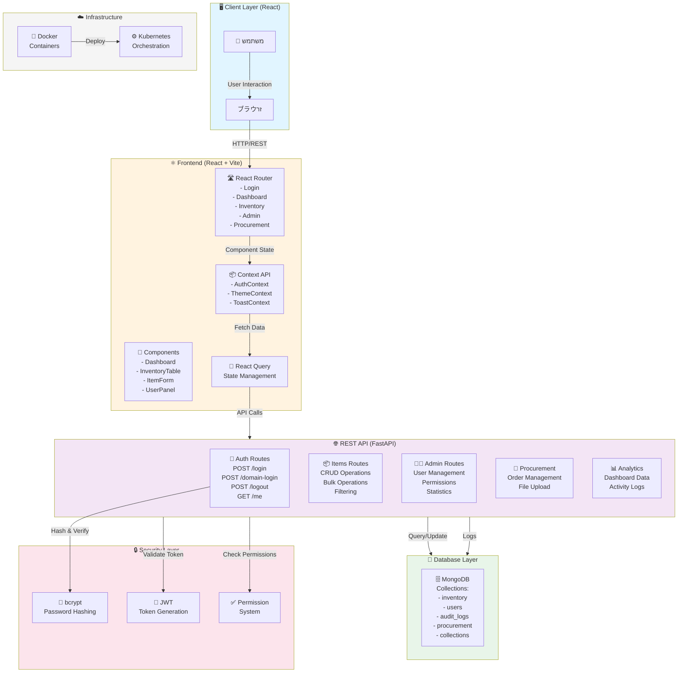

# 🏗️ ארכיטקטורה מערכת ניהול מלאי

## 📋 תוכן עניינים
1. [דיאגרמת ארכיטקטורה](#דיאגרמת-ארכיטקטורה)
2. [API Endpoints](#api-endpoints)
3. [Frontend Components](#frontend-components)
4. [זרימת Authentication](#זרימת-authentication)
5. [תכונות מיוחדות](#תכונות-מיוחדות)

---

## 📐 דיאגרמת ארכיטקטורה



---

## 🔐 זרימת Authentication

```
┌─────────────────────────────────────────────────────────────┐
│                    🔐 Authentication Flow                    │
├─────────────────────────────────────────────────────────────┤
│                                                              │
│  1. LOGIN REQUEST                                            │
│     User submits: { username, password }                     │
│                   ↓                                          │
│  2. BACKEND VALIDATION                                       │
│     - Check user exists in MongoDB                           │
│     - Verify password with bcrypt                            │
│     - Check user is active                                   │
│                   ↓                                          │
│  3. TOKEN GENERATION                                         │
│     - Create JWT token with:                                 │
│       • user_id, username, role, permissions                │
│       • Expiration: 240 minutes                              │
│                   ↓                                          │
│  4. RESPONSE                                                 │
│     Return: { access_token, token_type: "bearer" }           │
│                   ↓                                          │
│  5. CLIENT STORAGE                                           │
│     Store token in localStorage/sessionStorage               │
│                   ↓                                          │
│  6. SUBSEQUENT REQUESTS                                      │
│     Send: Authorization: Bearer <token>                       │
│                   ↓                                          │
│  7. TOKEN VERIFICATION                                       │
│     - Verify JWT signature                                   │
│     - Check expiration                                       │
│     - Extract claims (user_id, role, permissions)            │
│                   ↓                                          │
│  8. PERMISSION CHECK                                         │
│     - Extract required permission from route                 │
│     - Check user's permission list                           │
│     - Allow/Deny access                                      │
│                                                              │
│  🔑 DOMAIN LOGIN (ADFS) OPTION:                              │
│     POST /auth/domain-login → Validate with ADFS server     │
│                                                              │
│  📤 LOGOUT:                                                  │
│     POST /auth/logout → Clear client token                   │
│                                                              │
└─────────────────────────────────────────────────────────────┘
```

---

## 🔗 API Endpoints

### 🔐 Authentication (`/api/auth`)

| Method | Endpoint | תיאור | Input | Output | הרשאות |
|--------|----------|--------|-------|---------|---------|
| **POST** | `/login` | התחברות עם שם משתמש וסיסמה | `{ username, password }` | `{ access_token, token_type, user_id, username, role, permissions }` | ❌ ללא הרשאה |
| **POST** | `/domain-login` | התחברות באמצעות ADFS/דומיין | `{ domain, username, password }` | `{ access_token, token_type, ... }` | ❌ ללא הרשאה |
| **POST** | `/logout` | התנתקות מהמערכת | - | `{ message: "logged out" }` | ✅ משתמש רשום |
| **GET** | `/me` | קבלת פרטי המשתמש המחובר | - | `{ username, role, permissions, user_id }` | ✅ משתמש רשום |
| **PUT** | `/password` | שינוי סיסמה עצמית | `{ current_password, new_password }` | `{ message: "password changed" }` | ✅ משתמש רשום |

---

### 📦 Items - ניהול פריטים (`/api/items`)

| Method | Endpoint | תיאור | Input | Output | הרשאות |
|--------|----------|--------|-------|---------|---------|
| **GET** | `/` | קבלת כל הפריטים עם סינון וחיפוש | Query: `filter, search, sort, page, limit` | `{ items: [...], total, page, limit }` | `INVENTORY_RO` / `INVENTORY_RW` |
| **GET** | `/stale` | קבלת פריטים שלא עודכנו זמן רב | Query: `days, page, limit` | `{ items: [...], total, page }` | `INVENTORY_RO` / `INVENTORY_RW` |
| **GET** | `/{item_id}/collections` | קבלת אוספים המשוייכים לפריט | - | `{ collections: [...] }` | `INVENTORY_RO` / `INVENTORY_RW` |
| **POST** | `/` | הוספת פריט חדש | `ItemCreate { catalog_number, name, quantity, ... }` | `{ item_id, catalog_number, name, ... }` | `INVENTORY_RW` |
| **PATCH** | `/{item_id}` | עדכון שדה בודד בפריט | `ItemUpdate { field, value }` | `{ updated_item }` | `INVENTORY_RW` |
| **POST** | `/bulk-update` | עדכון מרובה של פריטים | `BulkUpdate { filters, updates }` | `{ updated_count, items }` | `INVENTORY_RW` |
| **DELETE** | `/{item_id}` | מחיקת פריט יחיד | `DeleteRequest { reason }` | `{ deleted_item }` | `INVENTORY_RW` |
| **POST** | `/bulk-delete` | מחיקת מספר פריטים | `{ item_ids, reason }` | `{ deleted_count }` | `INVENTORY_RW` |
| **POST** | `/delete-all` | מחיקת כל הפריטים (בזהירות!) | `DeleteRequest { reason }` | `{ deleted_count }` | Admin בלבד |

---

### 👥 Users - ניהול משתמשים (`/api/admin/users`)

| Method | Endpoint | תיאור | Input | Output | הרשאות |
|--------|----------|--------|-------|---------|---------|
| **GET** | `/` | קבלת כל המשתמשים | Query: `page, limit, filter` | `{ users: [...], total, page }` | Admin בלבד |
| **POST** | `/` | יצירת משתמש חדש | `UserCreate { username, email, password, role }` | `{ user_id, username, email, role, ... }` | Admin בלבד |
| **GET** | `/{user_id}` | קבלת פרטי משתמש ספציפי | - | `{ user_id, username, email, role, permissions, ... }` | Admin בלבד |
| **PUT** | `/{user_id}` | עדכון פרטי משתמש | `UserUpdate { username, email, role, permissions }` | `{ updated_user }` | Admin בלבד |
| **DELETE** | `/{user_id}` | מחיקת משתמש | `DeleteRequest { reason }` | `{ deleted_user }` | Admin בלבד |
| **GET** | `/stats` | סטטיסטיקות משתמשים | - | `{ total_users, active, inactive, by_role }` | Admin בלבד |

---

### 🛒 Groups - ניהול קבוצות (`/api/groups`)

| Method | Endpoint | תיאור | Input | Output | הרשאות |
|--------|----------|--------|-------|---------|---------|
| **GET** | `/` | קבלת כל הקבוצות | Query: `page, limit, filter` | `{ groups: [...], total, page }` | Admin / שיוך קבוצה |
| **POST** | `/` | יצירת קבוצה חדשה | `{ name, description, members }` | `{ group_id, name, ... }` | Admin בלבד |
| **GET** | `/{group_id}` | קבלת פרטי קבוצה | - | `{ group_id, name, members, ... }` | Admin / שיוך קבוצה |
| **PUT** | `/{group_id}` | עדכון קבוצה | `{ name, description, members }` | `{ updated_group }` | Admin בלבד |
| **DELETE** | `/{group_id}` | מחיקת קבוצה | - | `{ message: "deleted" }` | Admin בלבד |

---

### 📊 Excel - ייבוא/ייצוא (`/api/excel`)

| Method | Endpoint | תיאור | Input | Output | הרשאות |
|--------|----------|--------|-------|---------|---------|
| **POST** | `/import-excel` | ייבוא פריטים מ-Excel | FormData: `file (xlsx/csv)` | `{ imported_count, skipped, errors: [...] }` | `INVENTORY_RW` |
| **POST** | `/import-projects` | ייבוא פרויקטים מ-Excel | FormData: `file (xlsx)` | `{ imported_count, created_collections }` | Admin בלבד |
| **GET** | `/export-excel` | ייצוא כל הפריטים ל-Excel | Query: `format (xlsx/csv)` | `Binary (Excel File)` | `INVENTORY_RO` / `INVENTORY_RW` |

---

### 📋 Collections - אוספים (`/api/collections`)

| Method | Endpoint | תיאור | Input | Output | הרשאות |
|--------|----------|--------|-------|---------|---------|
| **GET** | `/` | קבלת כל האוספים | - | `{ collections: [...] }` | `INVENTORY_RO` / `INVENTORY_RW` |
| **POST** | `/` | יצירת אוסף חדש | `{ name, description, items }` | `{ collection_id, name, ... }` | `INVENTORY_RW` |
| **GET** | `/{collection_id}` | קבלת פרטי אוסף | - | `{ collection_id, name, items_count, ... }` | `INVENTORY_RO` / `INVENTORY_RW` |
| **PUT** | `/{collection_id}` | עדכון אוסף | `{ name, description }` | `{ updated_collection }` | `INVENTORY_RW` |
| **DELETE** | `/{collection_id}` | מחיקת אוסף | - | `{ message: "deleted" }` | `INVENTORY_RW` |
| **GET** | `/{collection_id}/items` | קבלת פריטים באוסף | - | `{ items: [...] }` | `INVENTORY_RO` / `INVENTORY_RW` |
| **POST** | `/{collection_id}/items` | הוספת פריט לאוסף | `{ item_id }` | `{ message: "added" }` | `INVENTORY_RW` |
| **POST** | `/{collection_id}/items/bulk` | הוספה מרובה לאוסף | `{ item_ids: [...] }` | `{ added_count }` | `INVENTORY_RW` |
| **PUT** | `/{collection_id}/items/{item_id}` | עדכון פריט באוסף | `{ field, value }` | `{ updated_item }` | `INVENTORY_RW` |
| **DELETE** | `/{collection_id}/items/{item_id}` | הסרת פריט מאוסף | - | `{ message: "removed" }` | `INVENTORY_RW` |
| **POST** | `/{collection_id}/items/bulk-delete` | הסרה מרובה מאוסף | `{ item_ids }` | `{ deleted_count }` | `INVENTORY_RW` |
| **POST** | `/{collection_id}/permissions` | הוספת הרשאה לאוסף | `{ user_id, permission }` | `{ message: "added" }` | Admin בלבד |
| **DELETE** | `/{collection_id}/permissions/{target_id}` | הסרת הרשאה מאוסף | - | `{ message: "removed" }` | Admin בלבד |

---

### 🛒 Procurement - הזמנות (`/api/procurement/orders`)

| Method | Endpoint | תיאור | Input | Output | הרשאות |
|--------|----------|--------|-------|---------|---------|
| **GET** | `/` | קבלת כל ההזמנות | Query: `status, page, limit, filter` | `{ orders: [...], total, page }` | `PROCUREMENT_RO` / `PROCUREMENT_RW` |
| **POST** | `/` | יצירת הזמנה חדשה | `ProcurementOrderCreate { supplier, items, amount }` | `{ order_id, status, ... }` | `PROCUREMENT_RW` |
| **GET** | `/{order_id}` | קבלת פרטי הזמנה | - | `{ order_id, supplier, items, status, ... }` | `PROCUREMENT_RO` / `PROCUREMENT_RW` |
| **PUT** | `/{order_id}` | עדכון הזמנה | `{ status, supplier, amount }` | `{ updated_order }` | `PROCUREMENT_RW` |
| **DELETE** | `/{order_id}` | ביטול הזמנה | `DeleteRequest { reason }` | `{ deleted_order }` | `PROCUREMENT_RW` |
| **POST** | `/{order_id}/files` | העלאת קובץ להזמנה | FormData: `file` | `{ file_id, filename, size, url }` | `PROCUREMENT_RW` |
| **GET** | `/{order_id}/files/{file_id}` | הורדת קובץ | - | `Binary (File)` | `PROCUREMENT_RO` / `PROCUREMENT_RW` |
| **DELETE** | `/{order_id}/files/{file_id}` | מחיקת קובץ | - | `{ message: "deleted" }` | `PROCUREMENT_RW` |

---

### 📊 Analytics - דיווחים (`/api/analytics`)

| Method | Endpoint | תיאור | Input | Output | הרשאות |
|--------|----------|--------|-------|---------|---------|
| **GET** | `/dashboard` | נתונים לדשבורד | - | `{ total_items, total_users, active_orders, statistics }` | משתמש רשום |
| **GET** | `/activity` | יומן פעילות אחרון | - | `{ activities: [...], total }` | משתמש רשום |
| **GET** | `/item/{catalog_number}` | דיווח פריט מסוים | - | `{ item_id, history, usage_stats, ... }` | `INVENTORY_RO` / `INVENTORY_RW` |

---

### 📝 Audit - רישום ביקורת (`/api/audit/logs`)

| Method | Endpoint | תיאור | Input | Output | הרשאות |
|--------|----------|--------|-------|---------|---------|
| **GET** | `/logs` | קבלת כל הרישומים | Query: `user, action, page, limit` | `{ logs: [...], total, page }` | Admin בלבד |
| **POST** | `/logs` | הוספת רישום (אוטומטי בד"כ) | `{ action, resource, details }` | `{ log_id, timestamp, ... }` | System בלבד |
| **GET** | `/users/{username}` | קבלת רישומים של משתמש | Query: `page, limit` | `{ logs: [...], total, page }` | Admin בלבד |

---

### 🔍 Users Search (`/api/users`)

| Method | Endpoint | תיאור | Input | Output | הרשאות |
|--------|----------|--------|-------|---------|---------|
| **GET** | `/search` | חיפוש משתמשים | Query: `q (query)` | `{ users: [{ id, username, email }] }` | `ADMIN` / `PROCUREMENT_RW` |
| **GET** | `/groups/search` | חיפוש קבוצות | Query: `q (query)` | `{ groups: [{ id, name }] }` | `ADMIN` |

---

## ⚛️ Frontend Components

### 🏗️ ניווט וLayout

#### 📄 Pages (דפים ראשיים)

| דף | Path | תיאור | קומפוננטות משנה | הרשאות |
|--------|--------|--------|------------------|---------|
| **LoginPage** | `/login` | דף התחברות | LoginForm, DomainLoginOption | ללא הרשאה |
| **DashboardPage** | `/dashboard` | דשבורד ראשי | WidgetCards, StatsCharts, RecentActivity | משתמש רשום |
| **InventoryTabbedPage** | `/inventory` | ניהול מלאי עם tabs | InventoryTable, ItemForm, BulkEditModal | `INVENTORY_RO/RW` |
| **AdminPage** | `/admin` | פנל ניהול | UserManagement, AuditLogs, Analytics | Admin בלבד |
| **AccessControlPage** | `/admin/access-control` | ניהול הרשאות | PermissionManager, GroupAssigner | Admin בלבד |
| **UserManagement** | `/admin/users` | ניהול משתמשים | UserTable, UserForm, BulkUserActions | Admin בלבד |
| **AuditLogs** | `/admin/logs` | רישום ביקורת | LogsTable, FilterPanel, ExportLogs | Admin בלבד |
| **ProcurementPage** | `/procurement` | ניהול הזמנות | OrdersList, OrderForm, OrderDetails | `PROCUREMENT_RO/RW` |
| **MyComponentsDashboard** | `/my-components` | ריכוז אוספים שלי | CollectionCards, FilterByCollection | משתמש רשום |
| **CollectionDetails** | `/my-components/{id}` | פרטי אוסף | CollectionTable, ManagePermissions | משתמש רשום |
| **UserGuidePage** | `/guide` | מדריך משתמש | DocumentationViewer | כל המשתמשים |

---

### 🧩 Inventory Components

| קומפוננטה | קובץ | תיאור | תכונות |
|-----------|--------|--------|---------|
| **InventoryTable** | `inventory/InventoryContent/` | טבלה ראשית של פריטים | סינון, חיפוש, pagination, sort, multiselect |
| **ItemForm** | `inventory/ItemForm/` | טופס הוספה/עריכה פריט | validation, auto-save, undo/redo |
| **ExcelManager** | `inventory/ExcelManager/` | ייבוא/ייצוא Excel | drag-drop, preview, mapping |
| **BulkEditModal** | `inventory/BulkEditModal/` | עריכה מרובה | select fields, apply to multiple |
| **DeleteConfirmation** | `inventory/DeleteConfirmation/` | אישור מחיקה | reason required, audit trail |
| **ColumnToggle** | `inventory/ColumnToggle/` | בחירת עמודות להציג | save preferences, reset |
| **AssociatedCollectionsModal** | `inventory/AssociatedCollectionsModal/` | הצגת אוספים | add/remove collections |

---

### 👥 Admin Components

| קומפוננטה | קובץ | תיאור | תכונות |
|-----------|--------|--------|---------|
| **UserTable** | `admin/` | טבלה של משתמשים | edit, delete, filter, search |
| **UserForm** | `admin/` | טופס יצירה/עריכה משתמש | role assignment, permissions picker |
| **AuditLogsTable** | `admin/` | רישום פעולות | search, filter by user, date range |
| **PermissionManager** | `admin/` | ניהול הרשאות | assign to user/group, bulk operations |
| **GroupManager** | `admin/` | ניהול קבוצות | create/edit/delete, add members |

---

### 🛒 Procurement Components

| קומפוננטה | קובץ | תיאור | תכונות |
|-----------|--------|--------|---------|
| **OrdersList** | `procurement/` | רשימת הזמנות | status filter, search, pagination |
| **OrderForm** | `procurement/` | טופס הזמנה | supplier select, item picker, amount |
| **OrderDetails** | `procurement/` | פרטי הזמנה מלאים | status timeline, files upload/download |
| **FileUpload** | `procurement/` | העלאת קבצים | drag-drop, progress, preview |

---

### 🎨 Common/Layout Components

| קומפוננטה | תיאור | תכונות |
|-----------|--------|---------|
| **Header** | כותרת עליונה | user menu, notifications, theme toggle |
| **Navigation** | תפריט ניווט | sidebar/mobile responsive, role-based visibility |
| **Spinner** | מוצג טעינה | size options, custom text |
| **Toast** | הודעות משוב | success/error/warning/info types |
| **Modal** | דיאלוג | close button, backdrop, scroll handling |
| **Table** | טבלה כללית | sorting, pagination, column control |
| **Form** | טופס כללי | validation, error handling, submit states |
| **ErrorBoundary** | תופס שגיאות | fallback UI, logging |

---

## 🔐 מערכת הרשאות (Permissions)

### 📋 סוגי הרשאות

```
┌─────────────────────────────────────────────────────────────┐
│                    📋 הרשאות במערכת                         │
├─────────────────────────────────────────────────────────────┤
│                                                              │
│  🎯 INVENTORY                                                │
│     ├─ INVENTORY_RO    (קריאה בלבד)                        │
│     └─ INVENTORY_RW    (קריאה וכתיבה)                      │
│                                                              │
│  🛒 PROCUREMENT                                              │
│     ├─ PROCUREMENT_RO  (קריאה בלבד)                        │
│     └─ PROCUREMENT_RW  (קריאה וכתיבה)                      │
│                                                              │
│  👥 ADMIN                                                    │
│     ├─ ADMIN          (כל ההרשאות)                         │
│     ├─ USER_MANAGE    (ניהול משתמשים)                     │
│     ├─ AUDIT_VIEW     (ביקורת עמודים)                      │
│     └─ PERMISSION_MANAGE (הרשאות)                          │
│                                                              │
│  🎨 OTHER                                                    │
│     └─ REPORTS        (ביקורת דיווחים)                      │
│                                                              │
│  👤 ROLES (תפקידים)                                          │
│     ├─ admin          (כל ההרשאות)                         │
│     ├─ manager        (רוב ההרשאות)                        │
│     ├─ user           (INVENTORY_RO בלבד)                  │
│     └─ procurement    (PROCUREMENT_RW)                      │
│                                                              │
└─────────────────────────────────────────────────────────────┘
```

### 🛡️ Token Structure

```json
{
  "sub": "username",
  "user_id": "507f1f77bcf86cd799439011",
  "username": "john.doe",
  "role": "admin",
  "permissions": ["INVENTORY_RW", "PROCUREMENT_RW", "ADMIN"],
  "exp": 1708123456,
  "iat": 1708040056,
  "iss": "warehouse-app"
}
```

---

## 💾 MongoDB Collections

### 📦 inventory
```javascript
{
  _id: ObjectId,
  catalog_number: String (unique, indexed),
  name: String,
  description: String,
  quantity: Number,
  reserved_stock: Number,
  available: Number,
  unit: String,
  category: String,
  location: String,
  supplier: String,
  cost: Number,
  price: Number,
  image_url: String,
  created_at: ISODate,
  updated_at: ISODate,
  updated_by: String,
  active: Boolean
}
```

### 👤 users
```javascript
{
  _id: ObjectId,
  username: String (unique, indexed),
  email: String (unique, indexed),
  password_hash: String (bcrypt),
  role: String,
  permissions: [String],
  is_active: Boolean,
  created_at: ISODate,
  updated_at: ISODate,
  last_login: ISODate,
  created_by: String,
  domain_user: Boolean
}
```

### 📋 collections
```javascript
{
  _id: ObjectId,
  name: String,
  description: String,
  items: [ObjectId],
  owner: ObjectId,
  permissions: [{
    user_id: ObjectId,
    permission: String  // 'view', 'edit', 'manage'
  }],
  created_at: ISODate,
  updated_at: ISODate
}
```

### 🛒 procurement_orders
```javascript
{
  _id: ObjectId,
  order_number: String (unique),
  supplier: String,
  items: [{
    item_id: ObjectId,
    quantity: Number,
    unit_price: Number
  }],
  total_amount: Number,
  status: String,  // 'pending', 'ordered', 'received', 'cancelled'
  expected_delivery: Date,
  actual_delivery: Date,
  created_by: ObjectId,
  created_at: ISODate,
  updated_at: ISODate
}
```

### 📝 audit_logs
```javascript
{
  _id: ObjectId,
  action: String,
  resource_type: String,  // 'item', 'user', 'order'
  resource_id: ObjectId,
  changes: Object,
  performed_by: String,
  timestamp: ISODate,
  ip_address: String,
  user_agent: String
}
```

---

## 🚀 Features מיוחדות

### ♻️ Undo/Redo System
- כל שינוי בפריט נשמר עם `undo_log_id`
- אפשרות לחזור/לחזור על פעולה
- מוגבל ל-50 פעולות אחרונות (ניתן להגדיר)

### 🔄 Real-time Sync
- React Query עם polling
- WebSocket support (עתידי)
- Optimistic updates

### 📊 Advanced Filtering
- סינון לפי כמה שדות
- חיפוש full-text
- save saved filters
- export results

### 🌙 Dark Mode
- Theme persistence
- System preference detection
- Smooth transitions

### 📱 Responsive Design
- Mobile-first approach
- Tablet optimization
- Desktop experience

### 🔒 Security Features
- BCRYPT password hashing
- JWT token-based auth
- ADFS/Domain login support
- Rate limiting (5 login attempts/minute)
- CORS protection
- Request logging

### 📈 Rate Limiting
- 5 login attempts per minute
- Global API rate limit (configurable)
- Per-user limits (future)

---

## 🏗️ Backend Architecture

### 📁 Folder Structure

```
backend/
├── app/
│   ├── __init__.py
│   ├── main.py                 # FastAPI app setup
│   ├── config.py               # Configuration
│   ├── dependencies.py         # Dependency injection
│   ├── core/
│   │   ├── constants.py        # App constants
│   │   ├── exceptions.py       # Custom exceptions
│   │   ├── limiter.py          # Rate limiter
│   │   ├── password.py         # Password hashing
│   │   ├── security.py         # JWT & auth utils
│   │   └── excel_parser.py     # Excel parsing
│   ├── db/
│   │   └── mongodb.py          # MongoDB connection
│   ├── routes/
│   │   └── api/
│   │       ├── __init__.py
│   │       ├── auth.py         # Authentication
│   │       ├── items.py        # Items CRUD
│   │       ├── admin.py        # Admin ops
│   │       ├── excel.py        # Import/Export
│   │       ├── procurement.py  # Orders
│   │       ├── analytics.py    # Reports
│   │       ├── audit.py        # Audit logs
│   │       ├── collections.py  # Collections
│   │       └── users.py        # User search
│   ├── schemas/
│   │   ├── auth.py
│   │   ├── item.py
│   │   ├── user.py
│   │   └── ...
│   └── services/
│       ├── auth_service.py
│       ├── item_service.py
│       ├── user_service.py
│       ├── excel_service.py
│       └── ...
├── tests/
│   ├── unit/
│   ├── integration/
│   └── conftest.py
├── migrations/
├── scripts/
└── Dockerfile
```

---

## ⚛️ Frontend Architecture

### 📁 Folder Structure

```
frontend/src/
├── App.jsx                    # Root component
├── main.jsx                   # Entry point
├── router.jsx                 # Route definitions
├── components/
│   ├── admin/                 # Admin panel components
│   ├── auth/                  # Auth components
│   ├── common/                # Reusable components
│   ├── dashboard/             # Dashboard components
│   ├── inventory/             # Inventory components
│   ├── layout/                # Header, Nav, Footer
│   ├── logs/                  # Logs viewer
│   ├── procurement/           # Procurement components
│   └── MyComponents/          # Collections manager
├── pages/
│   ├── LoginPage/
│   ├── DashboardPage/
│   ├── InventoryPage/
│   ├── AdminPage/
│   ├── ProcurementPage/
│   └── ...
├── context/
│   ├── AuthContext.jsx        # Auth state
│   ├── ThemeContext.jsx       # Theme state
│   └── ToastContext.jsx       # Notifications
├── hooks/
│   ├── useAuth.js
│   ├── useAPI.js
│   └── ...
├── lib/
│   ├── api.js                 # API client
│   └── ...
├── utils/
│   ├── formatters.js
│   ├── validators.js
│   └── ...
├── styles/
│   └── index.css              # Global styles
└── config/
    └── queryClient.js         # React Query config
```

---

## 🐳 Docker & Deployment

### Backend Dockerfile
```dockerfile
FROM python:3.11-slim

WORKDIR /app

COPY requirements.txt .
RUN pip install -r requirements.txt

COPY . .

CMD ["uvicorn", "app.main:app", "--host", "0.0.0.0", "--port", "8000"]
```

### Frontend Dockerfile
```dockerfile
FROM node:18-alpine as builder

WORKDIR /app

COPY package*.json ./
RUN npm ci

COPY . .
RUN npm run build

FROM node:18-alpine

WORKDIR /app
COPY --from=builder /app/dist ./dist
RUN npm install -g serve

CMD ["serve", "-s", "dist", "-l", "3000"]
```

---

## 📊 Data Flow Examples

### 🔐 Login Flow
```
User Input → LoginForm → POST /auth/login
    ↓
Backend validates credentials
    ↓
Generate JWT token
    ↓
Client stores token
    ↓
Redirect to /dashboard
    ↓
GET /auth/me with token
    ↓
Update AuthContext with user data
    ↓
Private routes accessible
```

### 📦 Add Item Flow
```
User clicks "Add Item"
    ↓
ItemForm Modal opens
    ↓
User fills form → POST /api/items with ItemCreate
    ↓
Backend validates and inserts
    ↓
Create audit log entry
    ↓
Response with new item_id
    ↓
React Query invalidates cache
    ↓
InventoryTable refetches data
    ↓
Toast notification shown
```

### 📥 Import Excel Flow
```
User selects file
    ↓
ExcelManager parses file
    ↓
Show preview with mapping
    ↓
User confirms import
    ↓
POST /api/excel/import-excel with file
    ↓
Backend parses and validates
    ↓
Bulk insert to MongoDB
    ↓
Return summary (imported, skipped, errors)
    ↓
Toast shows results
    ↓
InventoryTable refreshes
```

---

## 🔒 Security Layers

```
┌─────────────────────────────────────────────────────────┐
│                  🔒 Security Architecture                │
├─────────────────────────────────────────────────────────┤
│                                                          │
│  1️⃣  TRANSPORT                                           │
│      ├─ HTTPS/TLS (in production)                        │
│      └─ Secure cookies (HttpOnly)                        │
│                                                          │
│  2️⃣  AUTHENTICATION                                      │
│      ├─ bcrypt password hashing (rounds: 10)            │
│      ├─ JWT tokens (240 min expiration)                 │
│      └─ ADFS domain auth support                        │
│                                                          │
│  3️⃣  AUTHORIZATION                                       │
│      ├─ Role-based access control (RBAC)                │
│      ├─ Permission-based access (PBAC)                  │
│      └─ Collection-level permissions                    │
│                                                          │
│  4️⃣  API PROTECTION                                      │
│      ├─ CORS (whitelist origins)                        │
│      ├─ Rate limiting (5/min login)                     │
│      ├─ Input validation (Pydantic)                     │
│      └─ SQL injection prevention (MongoDB)              │
│                                                          │
│  5️⃣  LOGGING & AUDIT                                     │
│      ├─ All changes logged to audit_logs                │
│      ├─ User actions tracked (who, what, when)          │
│      ├─ IP address and User-Agent recorded              │
│      └─ Admin audit log review                          │
│                                                          │
│  6️⃣  DATA PROTECTION                                     │
│      ├─ Sensitive fields in env vars                    │
│      ├─ No hardcoded credentials                        │
│      ├─ MongoDB connection pooling                      │
│      └─ Encryption support (future)                     │
│                                                          │
└─────────────────────────────────────────────────────────┘
```

---

## 📈 Performance Optimizations

### Backend
- ✅ **Async/await** with FastAPI
- ✅ **MongoDB indexing** on frequently queried fields
- ✅ **Connection pooling** with MongoDB
- ✅ **GZIP compression** for responses > 1KB
- ✅ **Rate limiting** to prevent abuse
- ✅ **Response caching** (future)

### Frontend
- ✅ **Code splitting** with lazy loading
- ✅ **React Query** for server state caching
- ✅ **Context API** for local state
- ✅ **Memoization** for expensive components
- ✅ **Image optimization** (future)
- ✅ **Virtual scrolling** for large tables (future)

---

## 🧪 Testing

### Backend Testing
- **Unit tests**: Service layer logic
- **Integration tests**: API endpoints
- **Test database**: Separate MongoDB for tests
- **Fixtures**: conftest.py with common setups

### Frontend Testing
- **Component tests**: React components
- **E2E tests**: Playwright
- **API mocking**: MSW (Mock Service Worker)
- **Test files**: tests/e2e, tests/fixtures

---

## 📚 API Documentation

SwaggerUI is available at:
```
http://localhost:8000/docs
```

ReDoc at:
```
http://localhost:8000/redoc
```

---

## 🚀 Getting Started

### Backend Setup
```bash
cd backend
python -m venv venv
source venv/bin/activate  # On Windows: venv\Scripts\activate
pip install -r requirements.txt
python run.py
```

### Frontend Setup
```bash
cd frontend
npm install
npm run dev  # Development
npm run build  # Production
```

### Environment Variables
Create `.env` file in backend root:
```
MONGODB_URL=mongodb://localhost:27017
DB_NAME=warehouse
SECRET_KEY=your_secret_key_here
ENVIRONMENT=development
CORS_ORIGINS=["http://localhost:3000"]
```

---

## 📞 Support & Documentation

- **API Documentation**: `/docs` (Swagger)
- **Guides**: See `UserGuidePage` in frontend
- **Logs**: Audit logs in admin panel
- **Issues**: Check backend logs in `/uploads` or stdout

---

**Last Updated**: 17-02-2026
**Version**: 2.0.0
**Language**: עברית + English
