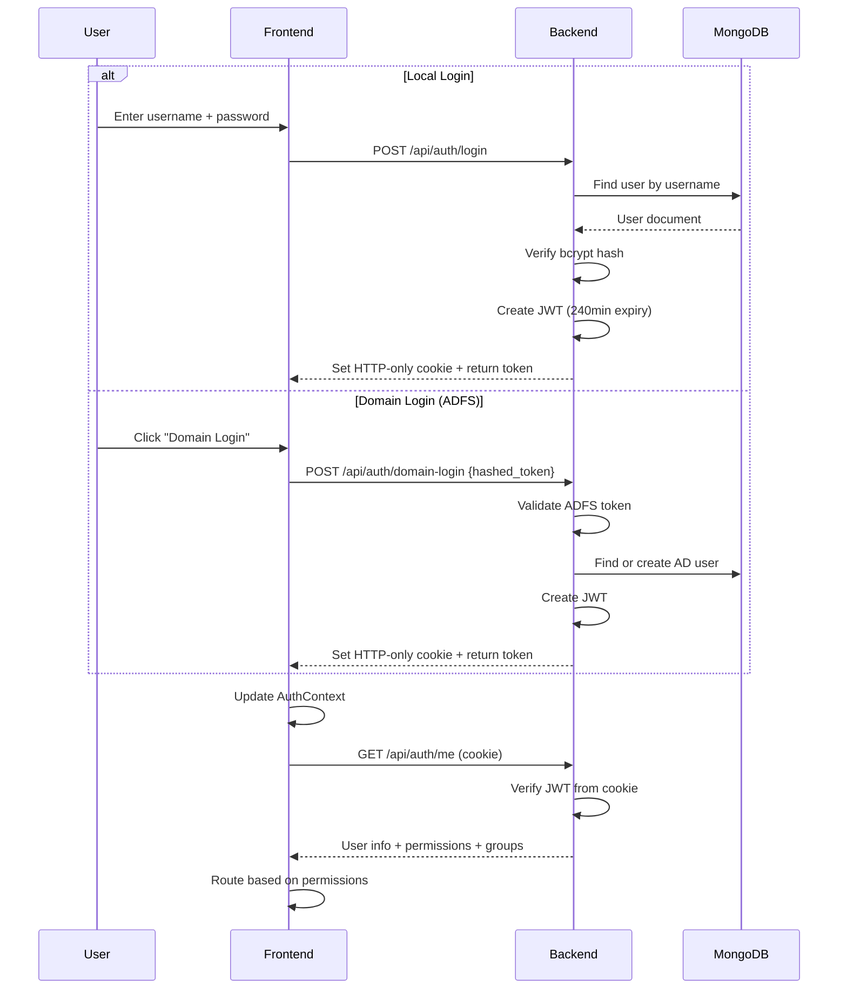

# 🏗️ Architecture — Warehouse Management System v2.0

## 📋 Table of Contents
1. [System Overview](#system-overview)
2. [Architecture Diagram](#architecture-diagram)
3. [Backend Architecture](#backend-architecture)
4. [Frontend Architecture](#frontend-architecture)
5. [Database Design](#database-design)
6. [Authentication & Authorization](#authentication--authorization)
7. [AI/ML Subsystem](#aiml-subsystem)
8. [File Storage](#file-storage)
9. [Infrastructure & Deployment](#infrastructure--deployment)

---

## 📐 System Overview

The Warehouse Management System (מערכת ניהול מלאי) is a full-stack web application for managing inventory, procurement, and supply chain operations. It comprises:

- **Backend**: Python FastAPI REST API with MongoDB
- **Frontend**: React (Vite) Single Page Application
- **Database**: MongoDB (9 collections)
- **AI/ML**: scikit-learn classifier for BOM component categorization
- **Storage**: S3-compatible or local filesystem for file attachments
- **Infrastructure**: Docker containers with Kubernetes (Helm) orchestration

---

## 📐 Architecture Diagram

```mermaid
graph TB
    subgraph CLIENT["🖥️ Client Layer"]
        BROWSER["Browser (Chrome/Edge/Firefox)"]
    end

    subgraph FRONTEND["⚛️ Frontend — React + Vite (Port 5173)"]
        ROUTER["React Router v6<br/>10 Routes + Guards"]
        CONTEXT["Context Providers<br/>Auth / Theme / Toast"]
        RQ["React Query<br/>Server State Cache"]
        PAGES["Pages<br/>Login | Dashboard | Inventory<br/>Procurement | MyComponents<br/>Admin | Guide"]
        HOOKS["35+ Custom Hooks<br/>useItems | useProcurement<br/>useUndoRedo | useAnalytics"]
        APISVC["API Services Layer<br/>auth | items | procurement<br/>collections | catalog | bom<br/>analytics | admin | audit"]
        AXIOS["Axios Client<br/>withCredentials | interceptors"]
    end

    subgraph BACKEND["🐍 Backend — FastAPI (Port 8000)"]
        MW["Middleware Stack<br/>CORS | GZip | RateLimit<br/>Process-Time | Logging"]
        ROUTES["Route Layer (10 routers)<br/>auth | items | excel | catalog<br/>collections | procurement | bom<br/>bom-analytics | ai | analytics<br/>audit | admin-users | admin-groups"]
        SERVICES["Service Layer (15 services)<br/>Auth | User | Group | Item<br/>Excel | Collection | Catalog<br/>Procurement | Analytics | Audit<br/>Bom | BomAnalytics | S3<br/>AI Training"]
        REPOS["Repository Layer (6 repos)<br/>Items | Users | Groups<br/>Collections | Procurement<br/>Catalog | Audit"]
        SCHEMAS["Pydantic Schemas<br/>Validation & Serialization"]
        SECURITY["Security Core<br/>JWT | bcrypt | RBAC<br/>Permissions | Guards"]
        AI["AI Classifier<br/>TF-IDF + LogisticRegression<br/>16 categories"]
        AUDITORS["Audit Subdomain<br/>Item | User | Group<br/>Collection | Procurement<br/>Auth Auditors"]
    end

    subgraph DATA["💾 Data Layer"]
        MONGO["MongoDB<br/>9 Collections"]
        S3["S3 / Local Storage<br/>File Attachments"]
    end

    subgraph INFRA["☁️ Infrastructure"]
        DOCKER["Docker Containers"]
        K8S["Kubernetes (Helm)"]
    end

    BROWSER -->|HTTPS / REST| MW
    MW --> ROUTES
    ROUTES -->|Depends()| SECURITY
    ROUTES --> SERVICES
    SERVICES --> REPOS
    SERVICES --> AUDITORS
    SERVICES --> AI
    REPOS --> MONGO
    SERVICES --> S3
    AUDITORS --> REPOS

    BROWSER --> ROUTER
    ROUTER --> PAGES
    PAGES --> HOOKS
    HOOKS --> APISVC
    APISVC --> AXIOS
    AXIOS -->|HTTP + Cookie| MW
    PAGES --> CONTEXT
    PAGES --> RQ

    DOCKER --> K8S

    style CLIENT fill:#e1f5ff
    style FRONTEND fill:#fff3e0
    style BACKEND fill:#f3e5f5
    style DATA fill:#e8f5e9
    style INFRA fill:#f5f5f5
```

---

## 🐍 Backend Architecture

### Layered Architecture

```
┌──────────────────────────────────────────────────┐
│  Routes (HTTP Interface)                         │
│  app/routes/*.py                                 │
│  Handle: request parsing, response formatting,   │
│  dependency injection, permission guards          │
├──────────────────────────────────────────────────┤
│  Services (Business Logic)                       │
│  app/services/*.py                               │
│  Handle: business rules, validation, audit       │
│  logging, cross-service orchestration            │
├──────────────────────────────────────────────────┤
│  Repositories (Data Access)                      │
│  app/db/repositories/*.py                        │
│  Handle: MongoDB queries, aggregations, CRUD     │
├──────────────────────────────────────────────────┤
│  Schemas (Validation)                            │
│  app/schemas/*.py                                │
│  Handle: Pydantic models for request/response    │
│  validation and serialization                    │
├──────────────────────────────────────────────────┤
│  Core (Security & Utils)                         │
│  app/core/*.py                                   │
│  Handle: JWT, bcrypt, RBAC, exceptions,          │
│  constants, permission guards                    │
└──────────────────────────────────────────────────┘
```

### Route Modules

| Router | Prefix | Description |
|--------|--------|-------------|
| `auth` | `/api/auth` | Login (local + ADFS), logout, user info, password change |
| `items` | `/api/items` | Inventory CRUD, bulk operations |
| `excel` | `/api/items` | Excel import/export (inventory + projects) |
| `catalog` | `/api/catalog` | Aggregated SKU catalog |
| `collections` | `/api/collections` | Personal collections with item management and permissions |
| `procurement` | `/api/procurement` | Procurement orders, file attachments |
| `bom` | `/api/bom` | BOM scanning with AI classification |
| `bom_analytics` | `/api/bom-analytics` | Price trends, vendor analytics |
| `ai` | `/api/ai` | Model retraining |
| `analytics` | `/api/analytics` | Dashboard stats, activity, item analytics |
| `audit` | `/api/audit` | Audit log queries |
| `admin_users` | `/api/admin/users` | User management (admin) |
| `admin_groups` | `/api/admin/groups` | Group management (admin) |
| `users_search` | `/api/users` | User/group search (autocomplete) |

### Service Layer

| Service | Responsibility |
|---------|---------------|
| `AuthService` | Login (local + ADFS), JWT token creation, password verification, AD user auto-creation |
| `UserService` | User CRUD, role hierarchy enforcement, password management, stats |
| `GroupService` | Group CRUD, permission aggregation |
| `ItemService` | Inventory CRUD, bulk operations, undo support, reserved stock sync, catalog auto-update |
| `ExcelService` | Smart import (serial vs catalog+location matching), project allocations import, filtered export |
| `CollectionService` | Collection CRUD, item assignment with snapshots, permission model (Owner/RW/RO), Excel export |
| `CatalogService` | Unique SKU catalog with aggregated stock across locations |
| `ProcurementService` | Order lifecycle management, auto status transitions, file storage, BOM Analytics integration |
| `AnalyticsService` | Dashboard KPIs, project distribution, activity stats, procurement aggregations |
| `AuditService` | Centralized audit logging, query by user/action/resource, action counting |
| `BomService` | Multi-vendor Excel parsing (NetApp/Dell/HPE/Cisco/Generic), AI enrichment |
| `BomAnalyticsService` | Historical price tracking, vendor spending, discount analysis, product chain comparison |
| `S3Service` | File upload/download/delete (S3 or local fallback) |
| `AITrainingService` | Classifier retraining from MongoDB + CSV data |

### Audit Subdomain

Specialized auditors for each domain, located in `app/services/audit/`:

| Auditor | Tracks |
|---------|--------|
| `ItemAuditor` | Item create, update, delete, bulk operations, import |
| `UserAuditor` | User create, update, delete, password changes |
| `GroupAuditor` | Group create, update, delete |
| `CollectionAuditor` | Collection CRUD, item add/remove |
| `ProcurementAuditor` | Order CRUD, file upload/download |
| `AuthAuditor` | Login, logout, domain login |

### Middleware Stack

```
Request → CORS → GZip (>1KB) → Private-Network-Header → Process-Time Logger → Rate Limiter → Route Handler
```

1. **CORS**: Allows configured origins (localhost:3000, localhost:5173)
2. **GZip Compression**: Compresses responses > 1KB
3. **Private Network Header**: Sets Access-Control-Allow-Private-Network
4. **Process Time**: Logs `X-Process-Time` header + detailed request logging
5. **Global Exception Handler**: Catches unhandled errors → standardized HTTP errors
6. **Rate Limiting**: slowapi-based (5/min on login)

### Dependency Injection

All services and repositories are injected via FastAPI's `Depends()` system:

```python
# Example route with dependency injection
@router.get("/items")
async def get_items(
    filters: ItemFilter = Depends(),
    current_user = Depends(require_permission(Permission.INVENTORY_RO)),
    item_service: ItemService = Depends(get_item_service)
):
    return await item_service.get_items(filters)
```

**Factory functions** in `app/dependencies.py` create per-request service instances, each receiving their required repositories.

---

## ⚛️ Frontend Architecture

### Application Shell

```
App.jsx
├── ErrorBoundary
├── QueryClientProvider (React Query)
├── ToastProvider
├── AuthProvider
├── ThemeProvider (dark/light + variant: normal/wood/space)
└── AppRouter (React Router v6)
```

### Route Structure

| Path | Component | Guard | Permission |
|------|-----------|-------|------------|
| `/login` | LoginPage | Public | — |
| `/dashboard` | DashboardPage | PrivateRoute | Authenticated |
| `/inventory` | InventoryTabbedPage | PermissionRoute | `inventory:ro` |
| `/admin` | AccessControlPage | AdminRoute | Admin/SuperAdmin |
| `/admin/users` | UserManagement | AdminRoute | Admin/SuperAdmin |
| `/admin/audit` | AuditLogs | AdminRoute | Admin/SuperAdmin |
| `/procurement` | ProcurementPage | ProcurementRoute | Any procurement permission |
| `/my-components` | MyComponentsDashboard | PrivateRoute | Authenticated |
| `/my-components/:id` | CollectionDetails | PrivateRoute | Authenticated |
| `/guide` | UserGuidePage | PrivateRoute | Authenticated |

### Route Guards

| Guard | Logic |
|-------|-------|
| `PrivateRoute` | Checks `isAuthenticated` |
| `AdminRoute` | `isAuthenticated` + `isAdmin` |
| `PermissionRoute` | `isAuthenticated` + specific permission (RW→RO fallback) |
| `ProcurementRoute` | `isAuthenticated` + `hasProcurementAccess()` |

### Context Providers

| Context | Purpose | Key Values |
|---------|---------|------------|
| **AuthContext** | Authentication state + permission checks | `user`, `isAuthenticated`, `isAdmin`, `isSuperAdmin`, `permissions`, `hasPermission()`, `hasVendorAccess()`, `hasPricePermission()`, `hasProcurementAccess()` |
| **ThemeContext** | Dark/Light mode + visual variants | `mode` (dark/light), `variant` (normal/wood/space), persisted in localStorage |
| **ToastContext** | Notification system | `addToast()`, `success()`, `error()`, `info()`, `warning()` — auto-dismiss after 5s |

### State Management

```
┌─────────────────────────────────────────────────────┐
│  localStorage                                        │
│  ├── auth token (JWT)                               │
│  ├── theme_mode / theme_variant                     │
│  └── column visibility preferences                  │
├─────────────────────────────────────────────────────┤
│  Context API (Global UI State)                      │
│  ├── AuthContext (user, permissions, methods)        │
│  ├── ThemeContext (mode, variant)                    │
│  └── ToastContext (notifications)                    │
├─────────────────────────────────────────────────────┤
│  React Query (Server State)                         │
│  ├── GET /items → queryKey: ['items', filters...]   │
│  ├── GET /procurement/orders → queryKey: ['orders'] │
│  ├── GET /analytics/dashboard → 5-min cache         │
│  └── Automatic cache invalidation on mutations      │
├─────────────────────────────────────────────────────┤
│  Component State (useState)                         │
│  ├── Form inputs                                    │
│  ├── Modal open/close states                        │
│  ├── Selected table rows                            │
│  ├── Current page / filters                         │
│  └── Undo/redo stacks                               │
└─────────────────────────────────────────────────────┘
```

### API Services Layer

All API calls are routed through service modules in `src/api/services/`. Components never make direct HTTP calls.

| Service | Methods |
|---------|---------|
| `authService` | `login()`, `domainLogin()`, `logout()`, `getMe()`, `checkAuth()` |
| `itemService` | `getItems()`, `getItemById()`, `createItem()`, `updateItem()`, `bulkUpdate()`, `deleteItem()`, `bulkDelete()`, `deleteAll()`, `getStaleItems()`, `getItemCollections()` |
| `procurementService` | `getOrders()`, `createOrder()`, `updateOrder()`, `deleteOrder()`, `uploadFile()`, `downloadFile()`, `deleteFile()` |
| `collectionsService` | `getCollections()`, `getCollection()`, `createCollection()`, `updateCollection()`, `deleteCollection()`, `getCollectionItems()`, `addItem()`, `bulkAddItem()`, `removeItem()`, `bulkRemoveItems()`, `updateItem()`, `updatePermissions()`, `removePermission()`, `exportCollection()` |
| `catalogService` | Catalog search/filter queries |
| `excelService` | `importExcel()`, `importProjects()`, `exportExcel()` |
| `adminService` | `getUsers()`, `createUser()`, `updateUser()`, `deleteUser()`, `getStats()`, `changePassword()` |
| `groupService` | Group CRUD |
| `analyticsService` | `getDashboardStats()`, `getItemProjectStats()`, `getActivityStats()` |
| `auditService` | Audit log queries |
| `bomService` | BOM scan, parts management |
| `bomAnalyticsService` | Price trends, vendor analytics |

**Axios Client Configuration:**
- Base URL from `VITE_API_URL` env variable
- `withCredentials: true` (sends cookies)
- 401 response interceptor → redirect to `/login`

### Key Custom Hooks

| Hook | Purpose |
|------|---------|
| `useAuthQuery` | Auth state with React Query, domain login handshake |
| `useItems` | Inventory CRUD with optimistic updates and undo/redo |
| `useCatalog` | Catalog queries with 30s cache |
| `useMyComponents` | Collection list with search/filter |
| `useAnalytics` | Dashboard stats with 5-min cache and date range |
| `useInventoryModals` | Centralized modal state for inventory page |
| `useProcurementModals` | Centralized modal state for procurement page |
| `useUndoRedo` | Separate edit/delete stacks, max 50 history |
| `usePagination` | Pagination state management |
| `useAddToCollection` | Item-to-collection assignment workflow |
| `useColumnVisibility` | Column show/hide with localStorage persistence |
| `useInventorySelection` | Bulk row selection + select-all |
| `useDebounce` | Input debouncing for search/filters |
| `useExcelManager` | Excel import/export operations |
| `useCollectionDetails` | Collection items + permissions |
| `useCollectionPermissions` | Permission CRUD for collections |
| `useKeyboardNavigation` | Keyboard shortcuts (Ctrl+Z, Ctrl+Y, etc.) |
| `useContextMenu` | Right-click context menu |
| `useColumnResize` | Draggable column resizing |
| `useCellEditing` | Inline cell editing |

### Component Structure

```
src/components/
├── common/              # Reusable UI primitives
│   ├── Button/
│   ├── Input/
│   ├── Modal/
│   ├── DeleteModal/
│   ├── NavigationWarningModal/
│   ├── Pagination/
│   ├── PermissionGate/
│   ├── Select/
│   ├── SelectionIndicator/
│   ├── Spinner/
│   ├── Tabs/
│   ├── Toast/ToastContainer/
│   ├── TableCell/
│   ├── ContextMenu/
│   ├── ErrorBoundary/
│   ├── FloatingToolbar/
│   ├── ScrollableTableLayout/
│   ├── UploadAnimation/
│   └── Skeleton*/        # SkeletonTable, SkeletonCards, SkeletonOrderCards
├── auth/                # LoginForm
├── admin/               # UserForm, GroupForm, PermissionSelector, AiToolsPanel
├── catalog/             # CatalogTable
├── dashboard/           # StatCard, ChartCard, charts/*
│   └── charts/          # ProjectDistribution, TargetSite, ItemSearch,
│                        #   ActivityStats, Manufacturer, Location
├── inventory/           # InventoryHeader, InventoryContent, InventoryModals,
│                        #   ItemForm, ItemTable, ExcelManager, ColumnToggle,
│                        #   BulkEditModal, AssociatedCollectionsModal, InventoryFilters
├── logs/                # LogFilters, LogTimeline
├── MyComponents/        # CollectionCard, CollectionItemsTable,
│                        #   CreateCollectionDialog, AssignItemDialog, Settings/
└── procurement/         # ProcurementTable, ProcurementModal, ProcurementItems,
                         #   BomPrescanModal, BomPreviewModal, BomScannerTab,
                         #   OrderTypeModal, FileUploadZone, ProcurementFilesModal,
                         #   OrderHistoryModal, AnalyticsTab, ProcurementAnalyticsTab
```

---

## 💾 Database Design

### MongoDB Collections

| Collection | Purpose | Key Indexes |
|-----------|---------|-------------|
| `inventory` | Inventory items | `catalog_number`, `serial`, `location`, `created_at`, `updated_at` |
| `users` | User accounts | `username` (unique) |
| `groups` | User groups | `name` (unique) |
| `collections` | Personal collections | `owner_id` |
| `collection_items` | Item-to-collection assignments | `collection_id`, `item_id` |
| `procurement_orders` | Procurement orders with BOM data | `status`, `order_date`, `bom_vendor` |
| `warehouse-audit-logs` | Unified audit trail | `action`, `actor`, `timestamp`, `target_resource` |
| `bom_part_catalog` | Saved BOM parts for AI training | `part_number` |
| `bom_analytics` | Historical pricing data | `part_number`, `order_id` |

### Key Data Relationships

```
inventory (1) ←→ (N) collection_items (N) ←→ (1) collections
    │
    └── catalog_number → auto-updates → bom_part_catalog
    
users (1) ←→ (N) groups (via membership)
    │
    └── permissions → collections (Owner/RW/RO)

procurement_orders (1) ←→ (N) files (embedded array)
    │
    ├── bom_data → parsed BOM groups with AI classification
    └── prices → tracked in bom_analytics
```

### Item Schema (Inventory)

```python
{
  "_id": ObjectId,
  "catalog_number": str,       # SKU/Part number
  "description": str,          # Item description
  "manufacturer": str,         # Vendor/brand
  "location": str,             # Warehouse location
  "serial": str | None,        # Serial number (optional)
  "current_stock": str,        # Current quantity
  "warranty_expiry": str,      # Warranty date
  "reserved_stock": str,       # Human-readable allocation summary
  "project_allocations": dict, # { "Project A": 5, "Project B": 3 }
  "purpose": str,              # Item purpose
  "target_site": str,          # Destination site
  "notes": str,                # Free-form notes
  "created_at": datetime,
  "updated_at": datetime,
  "created_by": str
}
```

---

## 🔐 Authentication & Authorization

### Authentication Flow



### Permission Hierarchy

```
SuperAdmin
  └── Can manage Admins + all users
  └── ALL permissions implicitly granted
  
Admin
  └── Can manage Users (not other Admins/SuperAdmins)
  └── ALL permissions implicitly granted except SuperAdmin actions
  
User
  └── Only explicitly assigned permissions
  └── Inherits permissions from group membership
```

### Vendor-Specific Access

Procurement permissions are granular per vendor:
```
procurement:dell:ro    → Can view Dell orders
procurement:dell:rw    → Can create/edit Dell orders
procurement:hpe:ro     → Can view HPE orders
procurement:netapp:rw  → Can create/edit NetApp orders
...etc
```

Orders are filtered server-side based on the user's allowed vendor list.

---

## 🤖 AI/ML Subsystem

### BOM Component Classifier

```
┌─────────────────────────────────────────────┐
│  Input: Excel product description           │
│  "X6598-R6 100GbE QSFP28 LR4 Transceiver" │
├─────────────────────────────────────────────┤
│  Pipeline:                                  │
│  1. TF-IDF Vectorizer (text → features)     │
│  2. Logistic Regression Classifier          │
├─────────────────────────────────────────────┤
│  Output: Category + Confidence Score        │
│  → "sfp-qsfp" (confidence: 0.92)           │
│  → description_he: "ג'יביק QSFP28 100G LR4"│
└─────────────────────────────────────────────┘
```

### 16 Component Categories

| Category | Examples |
|----------|---------|
| `server-storage` | Storage systems (AFF-A90, FAS) |
| `server` | Compute servers |
| `disk-shelf` | Disk shelves, JBODs |
| `switch` | Network switches |
| `io-card` | I/O cards, HBAs, NICs |
| `disk` | HDDs, SSDs, NVMe drives |
| `cable` | Network cables, power cables |
| `sfp-qsfp` | Transceivers (OSFP, QSFP-DD, QSFP28, SFP+, etc.) |
| `cpu` | Processors |
| `memory` | RAM modules |
| `fan` | Cooling fans |
| `psu` | Power supply units |
| `license-capacity` | Capacity-based licenses |
| `license-software` | Software licenses |
| `support` | Support contracts |
| `other` | Uncategorized |

### Feature Extraction

Beyond classification, the AI extracts structured attributes:
- **Speed**: 400G, 100G, 25G, 10G
- **Cable length**: meters
- **Fiber type**: SMF, MMF
- **Connector**: MPO, LC
- **Disk capacity**: TB/GB
- **CPU frequency**: GHz
- **Memory size**: GB
- **PSU wattage**: Watts

### Training Pipeline

1. Merge verified parts from `bom_part_catalog` (MongoDB) with static CSV training set
2. Train/test split (80/20)
3. Stratified k-fold cross-validation
4. Save model to `app/ai/component_classifier_v2.pkl`
5. Minimum 20 samples required
6. Triggered manually by SuperAdmin via POST `/api/ai/retrain`

---

## 📁 File Storage

### Dual Storage Strategy

```
┌──────────────────────────────────────┐
│  S3Service                           │
│                                      │
│  if USE_S3 is configured:            │
│    → Upload to S3 bucket             │
│    → Store s3_key in order metadata  │
│  else:                               │
│    → Save to uploads/procurement/    │
│    → Store local_path in metadata    │
│                                      │
│  Max file size: 10MB                 │
│  Allowed: PDF, JPG, PNG, GIF,       │
│    XLSX, XLS, DOC, DOCX, TXT        │
└──────────────────────────────────────┘
```

Files are associated with procurement orders via embedded `files[]` array in the order document.

---

## ☁️ Infrastructure & Deployment

### Docker

| Container | Base Image | Port |
|-----------|-----------|------|
| Backend | Python 3.11 | 8000 |
| Frontend | Node.js (build) → Nginx | 80/443 |

### Kubernetes (Helm)

```
helm/
├── Chart.yaml
├── values.yaml
└── templates/
    ├── backend-deployment.yaml
    ├── backend-service.yaml
    ├── frontend-deployment.yaml
    └── frontend-service.yaml
```

### Configuration

| Variable | Description | Default |
|----------|-------------|---------|
| `MONGODB_URL` | MongoDB connection string | — |
| `DB_NAME` | Database name | `warehouse` |
| `SECRET_KEY` | JWT signing key | — |
| `ALGORITHM` | JWT algorithm | `HS256` |
| `ACCESS_TOKEN_EXPIRE_MINUTES` | Token TTL | `240` |
| `CORS_ORIGINS` | Allowed origins | `localhost:3000,5173` |
| `ENVIRONMENT` | Runtime environment | `production` |
| `USE_S3` | Enable S3 storage | `false` |
| `S3_BUCKET_NAME` | S3 bucket | — |
| `S3_REGION` | S3 region | — |
| `S3_ACCESS_KEY` / `S3_SECRET_KEY` | S3 credentials | — |
| `S3_ENDPOINT_URL` | Custom S3 endpoint (MinIO) | — |
| `ADFS_LOGIN_URL` | ADFS login page | — |
| `ADFS_TOKEN_INFO_URL` | ADFS token info | — |
| `ADFS_VALIDATE_URL` | ADFS validation | — |
| `VITE_API_URL` | Backend API URL (frontend) | — |
