# 🔄 Data Flow & Interaction Diagrams

## 📋 Table of Contents
1. [System Communication Flow](#system-communication-flow)
2. [Authentication Flows](#authentication-flows)
3. [Inventory Operations](#inventory-operations)
4. [Excel Import/Export](#excel-importexport)
5. [Collection Management](#collection-management)
6. [Procurement Lifecycle](#procurement-lifecycle)
7. [BOM Scanner & AI Flow](#bom-scanner--ai-flow)
8. [BOM Analytics & Price Intelligence](#bom-analytics--price-intelligence)
9. [Audit Trail](#audit-trail)
10. [Undo/Redo System](#undoredo-system)
11. [State Management Overview](#state-management-overview)
12. [Permission Check Flow](#permission-check-flow)
13. [Request-Response Lifecycle](#request-response-lifecycle)

---

## 📊 System Communication Flow

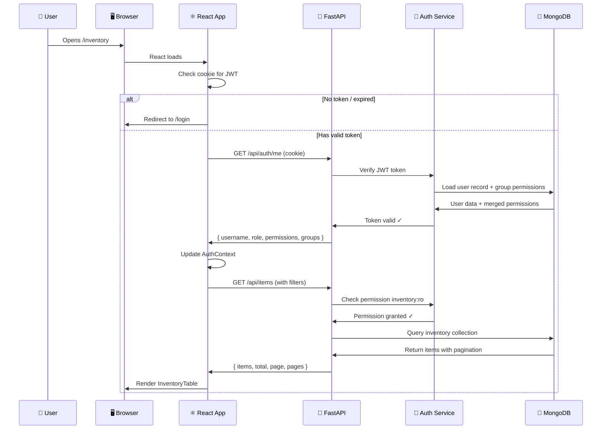
```mermaid
sequenceDiagram
    participant User as 👤 User
    participant Browser as 🖥️ Browser
    participant Frontend as ⚛️ React App
    participant API as 🔗 FastAPI
    participant Auth as 🔐 Auth Service
    participant DB as 💾 MongoDB

    User->>Browser: Opens /inventory
    Browser->>Frontend: React loads
    Frontend->>Frontend: Check cookie for JWT

    alt No token / expired
        Frontend->>Browser: Redirect to /login
    else Has valid token
        Frontend->>API: GET /api/auth/me (cookie)
        API->>Auth: Verify JWT token
        Auth->>DB: Load user record + group permissions
        DB->>Auth: User data + merged permissions
        Auth->>API: Token valid ✓
        API->>Frontend: { username, role, permissions, groups }
        Frontend->>Frontend: Update AuthContext
        Frontend->>API: GET /api/items (with filters)
        API->>Auth: Check permission inventory:ro
        Auth->>API: Permission granted ✓
        API->>DB: Query inventory collection
        DB->>API: Return items with pagination
        API->>Frontend: { items, total, page, pages }
        Frontend->>Browser: Render InventoryTable
    end
```

---

## 🔐 Authentication Flows

### Local Login

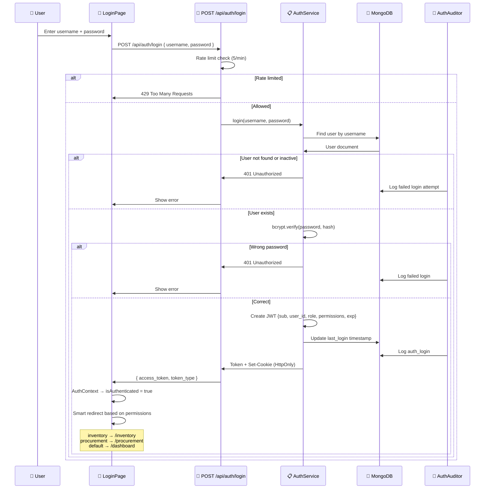
```mermaid
sequenceDiagram
    participant User as 👤 User
    participant UI as 🎨 LoginPage
    participant API as 🔗 POST /api/auth/login
    participant Service as 📋 AuthService
    participant DB as 💾 MongoDB
    participant Audit as 📝 AuthAuditor

    User->>UI: Enter username + password
    UI->>API: POST /api/auth/login { username, password }

    API->>API: Rate limit check (5/min)

    alt Rate limited
        API->>UI: 429 Too Many Requests
    else Allowed
        API->>Service: login(username, password)
        Service->>DB: Find user by username
        DB->>Service: User document

        alt User not found or inactive
            Service->>API: 401 Unauthorized
            Audit->>DB: Log failed login attempt
            API->>UI: Show error
        else User exists
            Service->>Service: bcrypt.verify(password, hash)

            alt Wrong password
                Service->>API: 401 Unauthorized
                Audit->>DB: Log failed login
                API->>UI: Show error
            else Correct
                Service->>Service: Create JWT {sub, user_id, role, permissions, exp}
                Service->>DB: Update last_login timestamp
                Audit->>DB: Log auth_login
                Service->>API: Token + Set-Cookie (HttpOnly)
                API->>UI: { access_token, token_type }
                UI->>UI: AuthContext → isAuthenticated = true
                UI->>UI: Smart redirect based on permissions
                Note over UI: inventory → /inventory<br/>procurement → /procurement<br/>default → /dashboard
            end
        end
    end
```

### Domain Login (ADFS)

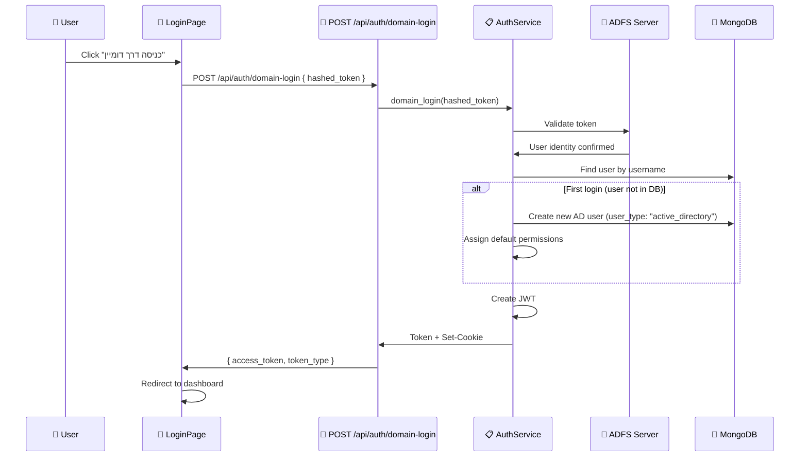
```mermaid
sequenceDiagram
    participant User as 👤 User
    participant UI as 🎨 LoginPage
    participant API as 🔗 POST /api/auth/domain-login
    participant Service as 📋 AuthService
    participant ADFS as 🏢 ADFS Server
    participant DB as 💾 MongoDB

    User->>UI: Click "כניסה דרך דומיין"
    UI->>API: POST /api/auth/domain-login { hashed_token }
    API->>Service: domain_login(hashed_token)
    Service->>ADFS: Validate token
    ADFS->>Service: User identity confirmed

    Service->>DB: Find user by username

    alt First login (user not in DB)
        Service->>DB: Create new AD user (user_type: "active_directory")
        Service->>Service: Assign default permissions
    end

    Service->>Service: Create JWT
    Service->>API: Token + Set-Cookie
    API->>UI: { access_token, token_type }
    UI->>UI: Redirect to dashboard
```

---

## 📦 Inventory Operations

### Create Item

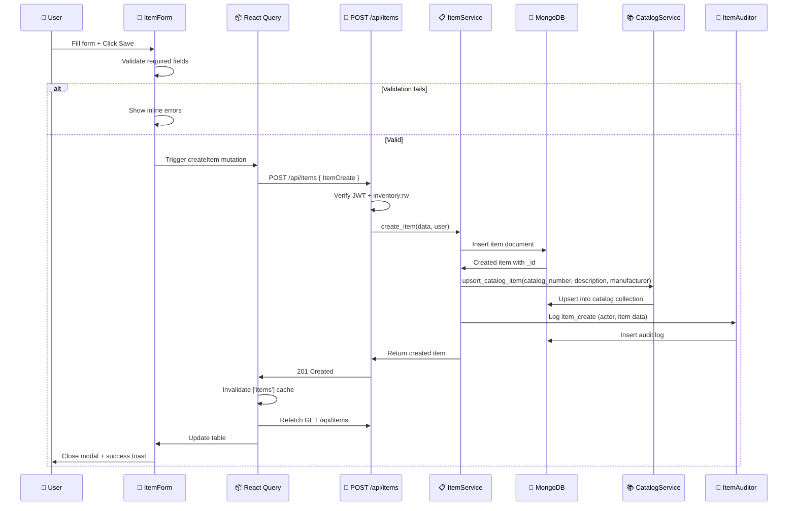
```mermaid
sequenceDiagram
    participant User as 👤 User
    participant UI as 🎨 ItemForm
    participant RQ as 📦 React Query
    participant API as 🔗 POST /api/items
    participant Service as 📋 ItemService
    participant DB as 💾 MongoDB
    participant Catalog as 📚 CatalogService
    participant Audit as 📝 ItemAuditor

    User->>UI: Fill form + Click Save
    UI->>UI: Validate required fields

    alt Validation fails
        UI->>UI: Show inline errors
    else Valid
        UI->>RQ: Trigger createItem mutation
        RQ->>API: POST /api/items { ItemCreate }
        API->>API: Verify JWT + inventory:rw
        API->>Service: create_item(data, user)
        Service->>DB: Insert item document
        DB->>Service: Created item with _id
        Service->>Catalog: upsert_catalog_item(catalog_number, description, manufacturer)
        Catalog->>DB: Upsert into catalog collection
        Service->>Audit: Log item_create (actor, item data)
        Audit->>DB: Insert audit log
        Service->>API: Return created item
        API->>RQ: 201 Created
        RQ->>RQ: Invalidate ['items'] cache
        RQ->>API: Refetch GET /api/items
        RQ->>UI: Update table
        UI->>User: Close modal + success toast
    end
```

### Update Single Field (Inline Edit)

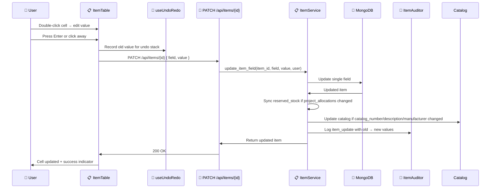
```mermaid
sequenceDiagram
    participant User as 👤 User
    participant Table as 📋 ItemTable
    participant Undo as 🔄 useUndoRedo
    participant API as 🔗 PATCH /api/items/{id}
    participant Service as 📋 ItemService
    participant DB as 💾 MongoDB
    participant Audit as 📝 ItemAuditor

    User->>Table: Double-click cell → edit value
    User->>Table: Press Enter or click away
    Table->>Undo: Record old value for undo stack
    Table->>API: PATCH /api/items/{id} { field, value }
    API->>Service: update_item_field(item_id, field, value, user)
    Service->>DB: Update single field
    DB->>Service: Updated item
    Service->>Service: Sync reserved_stock if project_allocations changed
    Service->>Catalog: Update catalog if catalog_number/description/manufacturer changed
    Service->>Audit: Log item_update with old → new values
    Service->>API: Return updated item
    API->>Table: 200 OK
    Table->>User: Cell updated + success indicator
```

### Bulk Update

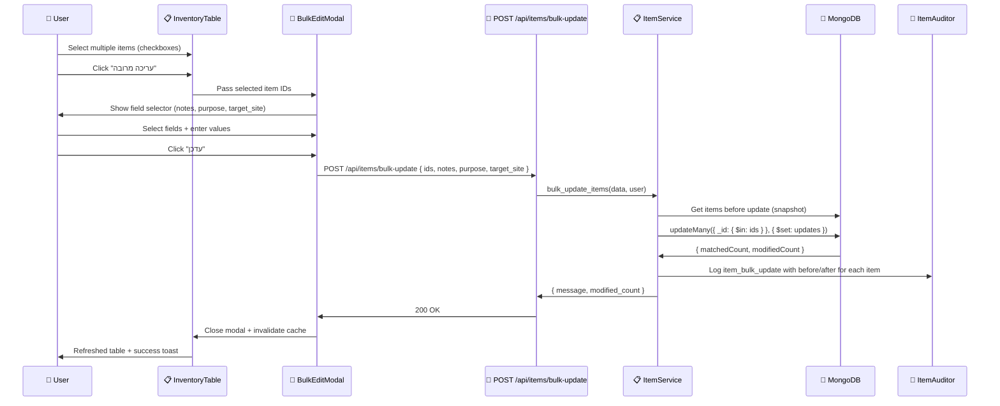
```mermaid
sequenceDiagram
    participant User as 👤 User
    participant Table as 📋 InventoryTable
    participant Modal as 🎨 BulkEditModal
    participant API as 🔗 POST /api/items/bulk-update
    participant Service as 📋 ItemService
    participant DB as 💾 MongoDB
    participant Audit as 📝 ItemAuditor

    User->>Table: Select multiple items (checkboxes)
    User->>Table: Click "עריכה מרובה"
    Table->>Modal: Pass selected item IDs
    Modal->>User: Show field selector (notes, purpose, target_site)
    User->>Modal: Select fields + enter values
    User->>Modal: Click "עדכן"

    Modal->>API: POST /api/items/bulk-update { ids, notes, purpose, target_site }
    API->>Service: bulk_update_items(data, user)
    Service->>DB: Get items before update (snapshot)
    Service->>DB: updateMany({ _id: { $in: ids } }, { $set: updates })
    DB->>Service: { matchedCount, modifiedCount }
    Service->>Audit: Log item_bulk_update with before/after for each item
    Service->>API: { message, modified_count }
    API->>Modal: 200 OK
    Modal->>Table: Close modal + invalidate cache
    Table->>User: Refreshed table + success toast
```

### Delete Item (with Audit)

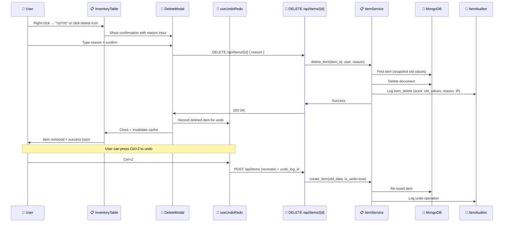
```mermaid
sequenceDiagram
    participant User as 👤 User
    participant Table as 📋 InventoryTable
    participant Modal as 🎨 DeleteModal
    participant Undo as 🔄 useUndoRedo
    participant API as 🔗 DELETE /api/items/{id}
    participant Service as 📋 ItemService
    participant DB as 💾 MongoDB
    participant Audit as 📝 ItemAuditor

    User->>Table: Right-click → "מחיקה" or click delete icon
    Table->>Modal: Show confirmation with reason input
    User->>Modal: Type reason + confirm

    Modal->>API: DELETE /api/items/{id} { reason }
    API->>Service: delete_item(item_id, user, reason)
    Service->>DB: Find item (snapshot old values)
    Service->>DB: Delete document
    Service->>Audit: Log item_delete (actor, old_values, reason, IP)
    Service->>API: Success
    API->>Modal: 200 OK
    Modal->>Undo: Record deleted item for undo
    Modal->>Table: Close + invalidate cache
    Table->>User: Item removed + success toast

    Note over User,Undo: User can press Ctrl+Z to undo
    User->>Undo: Ctrl+Z
    Undo->>API: POST /api/items (recreate) + undo_log_id
    API->>Service: create_item(old_data, is_undo=true)
    Service->>DB: Re-insert item
    Service->>Audit: Log undo operation
```

---

## 📥 Excel Import/Export

### Import Inventory from Excel

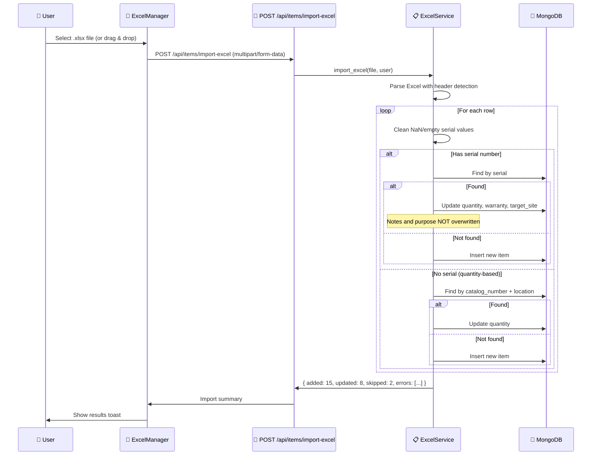
```mermaid
sequenceDiagram
    participant User as 👤 User
    participant UI as 🎨 ExcelManager
    participant API as 🔗 POST /api/items/import-excel
    participant Service as 📋 ExcelService
    participant DB as 💾 MongoDB

    User->>UI: Select .xlsx file (or drag & drop)
    UI->>API: POST /api/items/import-excel (multipart/form-data)
    API->>Service: import_excel(file, user)
    Service->>Service: Parse Excel with header detection

    loop For each row
        Service->>Service: Clean NaN/empty serial values

        alt Has serial number
            Service->>DB: Find by serial
            alt Found
                Service->>DB: Update quantity, warranty, target_site
                Note over Service: Notes and purpose NOT overwritten
            else Not found
                Service->>DB: Insert new item
            end
        else No serial (quantity-based)
            Service->>DB: Find by catalog_number + location
            alt Found
                Service->>DB: Update quantity
            else Not found
                Service->>DB: Insert new item
            end
        end
    end

    Service->>API: { added: 15, updated: 8, skipped: 2, errors: [...] }
    API->>UI: Import summary
    UI->>User: Show results toast
```

### Import Project Allocations

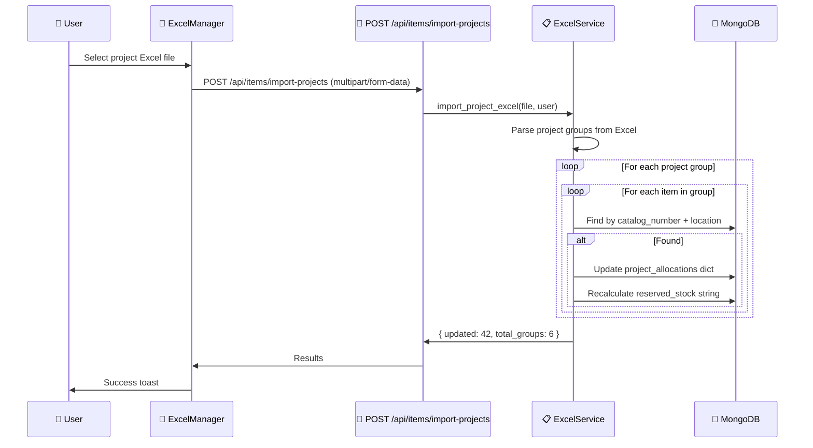
```mermaid
sequenceDiagram
    participant User as 👤 User
    participant UI as 🎨 ExcelManager
    participant API as 🔗 POST /api/items/import-projects
    participant Service as 📋 ExcelService
    participant DB as 💾 MongoDB

    User->>UI: Select project Excel file
    UI->>API: POST /api/items/import-projects (multipart/form-data)
    API->>Service: import_project_excel(file, user)
    Service->>Service: Parse project groups from Excel

    loop For each project group
        loop For each item in group
            Service->>DB: Find by catalog_number + location
            alt Found
                Service->>DB: Update project_allocations dict
                Service->>DB: Recalculate reserved_stock string
            end
        end
    end

    Service->>API: { updated: 42, total_groups: 6 }
    API->>UI: Results
    UI->>User: Success toast
```

### Export to Excel

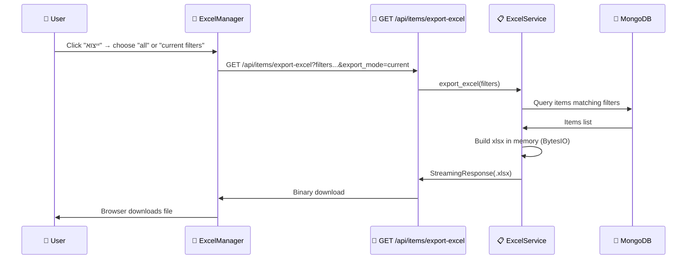
```mermaid
sequenceDiagram
    participant User as 👤 User
    participant UI as 🎨 ExcelManager
    participant API as 🔗 GET /api/items/export-excel
    participant Service as 📋 ExcelService
    participant DB as 💾 MongoDB

    User->>UI: Click "ייצוא" → choose "all" or "current filters"
    UI->>API: GET /api/items/export-excel?filters...&export_mode=current
    API->>Service: export_excel(filters)
    Service->>DB: Query items matching filters
    DB->>Service: Items list
    Service->>Service: Build xlsx in memory (BytesIO)
    Service->>API: StreamingResponse(.xlsx)
    API->>UI: Binary download
    UI->>User: Browser downloads file
```

---

## 📚 Collection Management

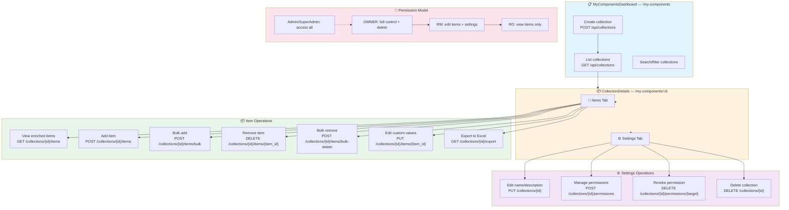
```mermaid
graph TB
    subgraph DASHBOARD["📋 MyComponentsDashboard — /my-components"]
        LIST["List collections<br/>GET /api/collections"]
        CREATE["Create collection<br/>POST /api/collections"]
        SEARCH["Search/filter collections"]
    end

    subgraph DETAILS["📦 CollectionDetails — /my-components/:id"]
        ITEMS_TAB["📑 Items Tab"]
        SETTINGS_TAB["⚙️ Settings Tab"]
    end

    subgraph ITEMS_OPS["📦 Item Operations"]
        VIEW_ITEMS["View enriched items<br/>GET /collections/{id}/items"]
        ADD_SINGLE["Add item<br/>POST /collections/{id}/items"]
        ADD_BULK["Bulk add<br/>POST /collections/{id}/items/bulk"]
        REMOVE["Remove item<br/>DELETE /collections/{id}/items/{item_id}"]
        BULK_REMOVE["Bulk remove<br/>POST /collections/{id}/items/bulk-delete"]
        EDIT_CUSTOM["Edit custom values<br/>PUT /collections/{id}/items/{item_id}"]
        EXPORT["Export to Excel<br/>GET /collections/{id}/export"]
    end

    subgraph SETTINGS_OPS["⚙️ Settings Operations"]
        EDIT_META["Edit name/description<br/>PUT /collections/{id}"]
        MANAGE_PERMS["Manage permissions<br/>POST /collections/{id}/permissions"]
        REVOKE["Revoke permission<br/>DELETE /collections/{id}/permissions/{target}"]
        DELETE_COL["Delete collection<br/>DELETE /collections/{id}"]
    end

    subgraph PERMISSIONS["🔐 Permission Model"]
        OWNER["OWNER: full control + delete"]
        RW["RW: edit items + settings"]
        RO["RO: view items only"]
        ADMIN_OVERRIDE["Admin/SuperAdmin: access all"]
    end

    LIST --> DETAILS
    CREATE --> LIST
    DETAILS --> ITEMS_TAB
    DETAILS --> SETTINGS_TAB
    ITEMS_TAB --> VIEW_ITEMS
    ITEMS_TAB --> ADD_SINGLE
    ITEMS_TAB --> ADD_BULK
    ITEMS_TAB --> REMOVE
    ITEMS_TAB --> BULK_REMOVE
    ITEMS_TAB --> EDIT_CUSTOM
    ITEMS_TAB --> EXPORT
    SETTINGS_TAB --> EDIT_META
    SETTINGS_TAB --> MANAGE_PERMS
    SETTINGS_TAB --> REVOKE
    SETTINGS_TAB --> DELETE_COL

    OWNER --> RW
    RW --> RO
    ADMIN_OVERRIDE -.-> OWNER

    style DASHBOARD fill:#e1f5ff
    style DETAILS fill:#fff3e0
    style ITEMS_OPS fill:#e8f5e9
    style SETTINGS_OPS fill:#f3e5f5
    style PERMISSIONS fill:#fce4ec
```

### Adding Items to Collections (Two Paths)

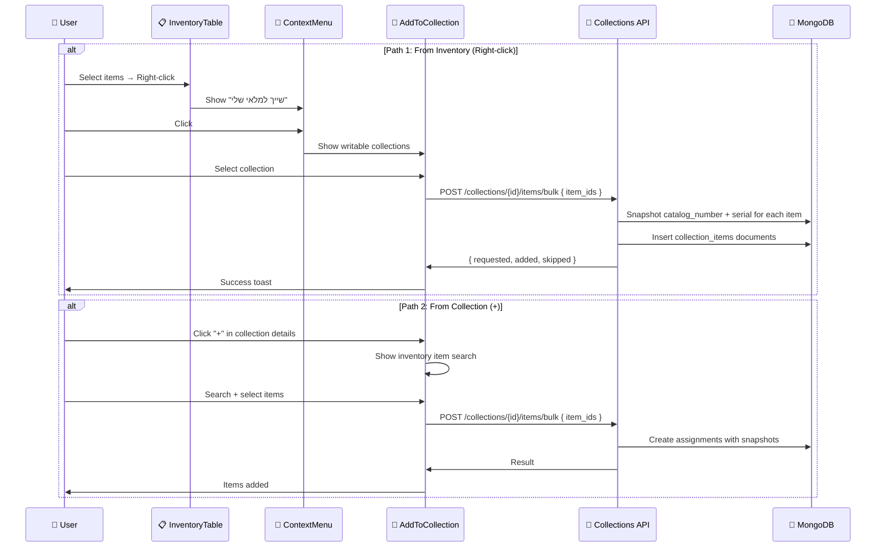
```mermaid
sequenceDiagram
    participant User as 👤 User
    participant Inventory as 📋 InventoryTable
    participant CtxMenu as 📌 ContextMenu
    participant Modal as 🎨 AddToCollection
    participant API as 🔗 Collections API
    participant DB as 💾 MongoDB

    alt Path 1: From Inventory (Right-click)
        User->>Inventory: Select items → Right-click
        Inventory->>CtxMenu: Show "שייך למלאי שלי"
        User->>CtxMenu: Click
        CtxMenu->>Modal: Show writable collections
        User->>Modal: Select collection
        Modal->>API: POST /collections/{id}/items/bulk { item_ids }
        API->>DB: Snapshot catalog_number + serial for each item
        API->>DB: Insert collection_items documents
        API->>Modal: { requested, added, skipped }
        Modal->>User: Success toast
    end

    alt Path 2: From Collection (+)
        User->>Modal: Click "+" in collection details
        Modal->>Modal: Show inventory item search
        User->>Modal: Search + select items
        Modal->>API: POST /collections/{id}/items/bulk { item_ids }
        API->>DB: Create assignments with snapshots
        API->>Modal: Result
        Modal->>User: Items added
    end
```

---

## 🛒 Procurement Lifecycle

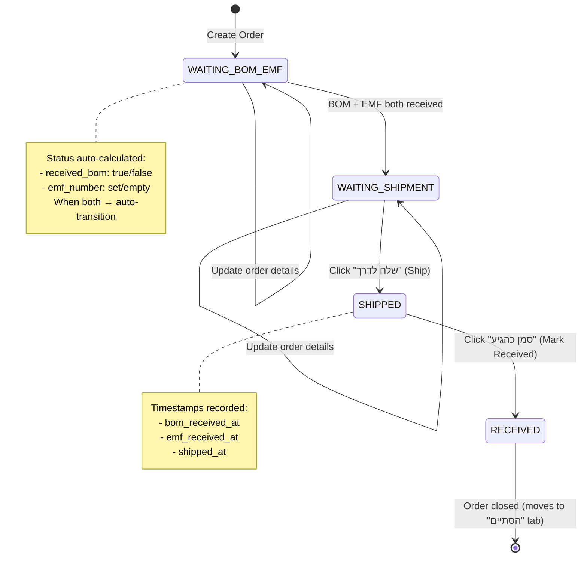
```mermaid
stateDiagram-v2
    [*] --> WAITING_BOM_EMF: Create Order

    WAITING_BOM_EMF --> WAITING_BOM_EMF: Update order details
    WAITING_BOM_EMF --> WAITING_SHIPMENT: BOM + EMF both received

    WAITING_SHIPMENT --> WAITING_SHIPMENT: Update order details
    WAITING_SHIPMENT --> SHIPPED: Click "שלח לדרך" (Ship)

    SHIPPED --> RECEIVED: Click "סמן כהגיע" (Mark Received)

    RECEIVED --> [*]: Order closed (moves to "הסתיים" tab)

    note right of WAITING_BOM_EMF
        Status auto-calculated:
        - received_bom: true/false
        - emf_number: set/empty
        When both → auto-transition
    end note

    note right of SHIPPED
        Timestamps recorded:
        - bom_received_at
        - emf_received_at
        - shipped_at
    end note
```

### Create Procurement Order

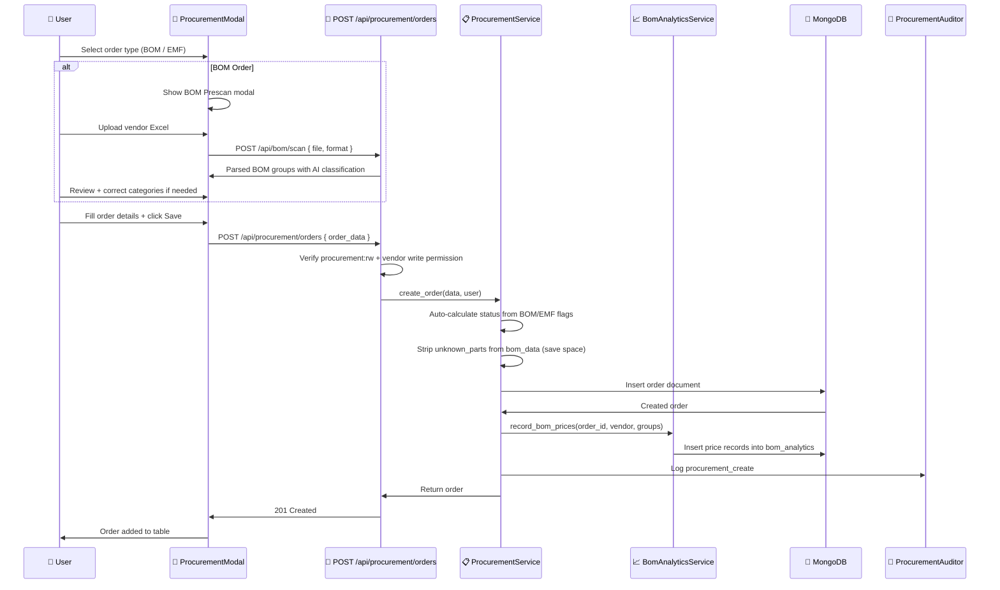
```mermaid
sequenceDiagram
    participant User as 👤 User
    participant UI as 🎨 ProcurementModal
    participant API as 🔗 POST /api/procurement/orders
    participant Service as 📋 ProcurementService
    participant BomAnalytics as 📈 BomAnalyticsService
    participant DB as 💾 MongoDB
    participant Audit as 📝 ProcurementAuditor

    User->>UI: Select order type (BOM / EMF)

    alt BOM Order
        UI->>UI: Show BOM Prescan modal
        User->>UI: Upload vendor Excel
        UI->>API: POST /api/bom/scan { file, format }
        API->>UI: Parsed BOM groups with AI classification
        User->>UI: Review + correct categories if needed
    end

    User->>UI: Fill order details + click Save
    UI->>API: POST /api/procurement/orders { order_data }
    API->>API: Verify procurement:rw + vendor write permission
    API->>Service: create_order(data, user)
    Service->>Service: Auto-calculate status from BOM/EMF flags
    Service->>Service: Strip unknown_parts from bom_data (save space)
    Service->>DB: Insert order document
    DB->>Service: Created order

    Service->>BomAnalytics: record_bom_prices(order_id, vendor, groups)
    BomAnalytics->>DB: Insert price records into bom_analytics

    Service->>Audit: Log procurement_create
    Service->>API: Return order
    API->>UI: 201 Created
    UI->>User: Order added to table
```

### File Upload/Download

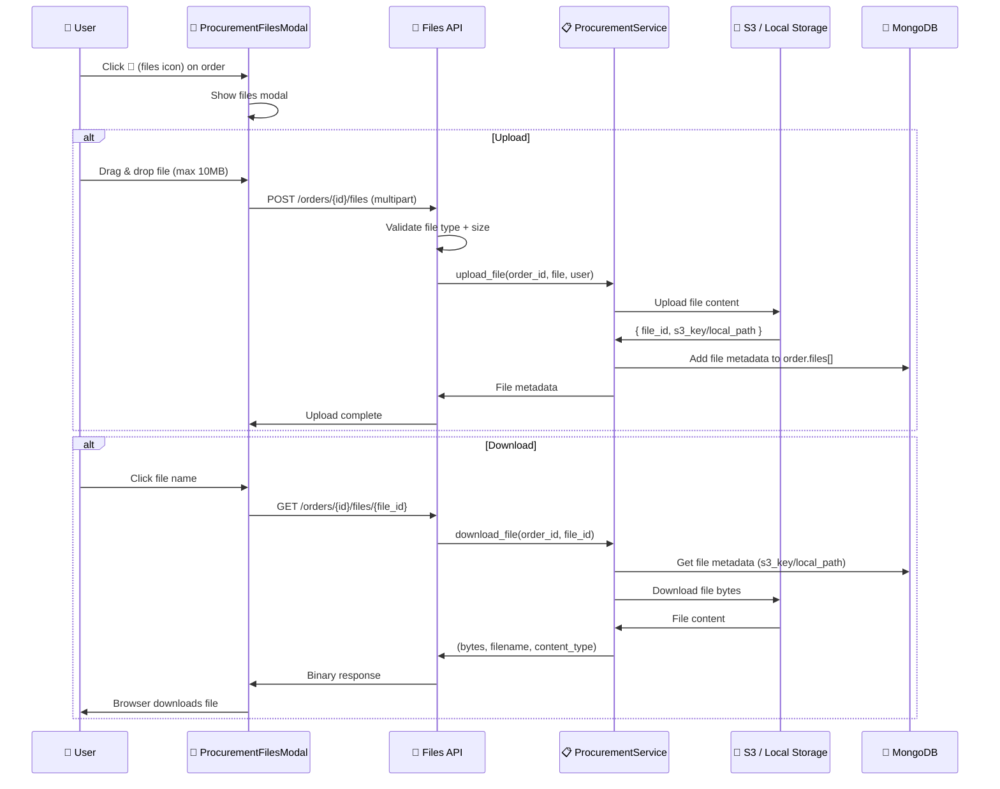
```mermaid
sequenceDiagram
    participant User as 👤 User
    participant UI as 🎨 ProcurementFilesModal
    participant API as 🔗 Files API
    participant Service as 📋 ProcurementService
    participant S3 as 📁 S3 / Local Storage
    participant DB as 💾 MongoDB

    User->>UI: Click 📎 (files icon) on order
    UI->>UI: Show files modal

    alt Upload
        User->>UI: Drag & drop file (max 10MB)
        UI->>API: POST /orders/{id}/files (multipart)
        API->>API: Validate file type + size
        API->>Service: upload_file(order_id, file, user)
        Service->>S3: Upload file content
        S3->>Service: { file_id, s3_key/local_path }
        Service->>DB: Add file metadata to order.files[]
        Service->>API: File metadata
        API->>UI: Upload complete
    end

    alt Download
        User->>UI: Click file name
        UI->>API: GET /orders/{id}/files/{file_id}
        API->>Service: download_file(order_id, file_id)
        Service->>DB: Get file metadata (s3_key/local_path)
        Service->>S3: Download file bytes
        S3->>Service: File content
        Service->>API: (bytes, filename, content_type)
        API->>UI: Binary response
        UI->>User: Browser downloads file
    end
```

---

## 🔍 BOM Scanner & AI Flow

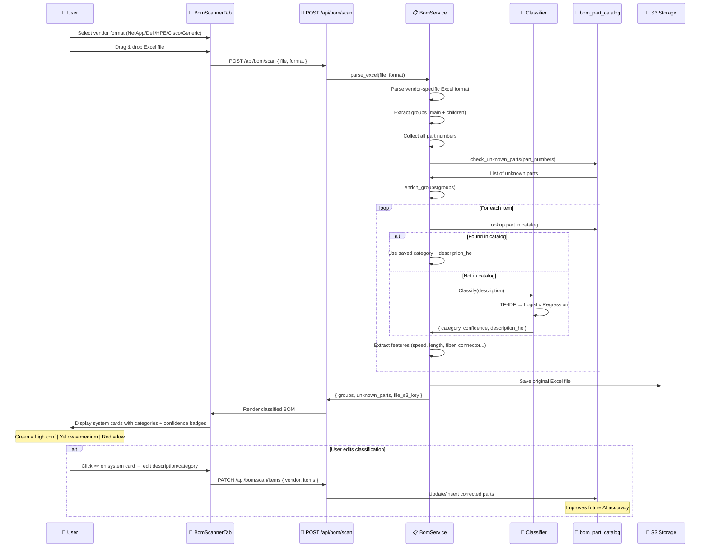
```mermaid
sequenceDiagram
    participant User as 👤 User
    participant UI as 🎨 BomScannerTab
    participant API as 🔗 POST /api/bom/scan
    participant BomService as 📋 BomService
    participant AI as 🤖 Classifier
    participant CatalogDB as 💾 bom_part_catalog
    participant S3 as 📁 S3 Storage

    User->>UI: Select vendor format (NetApp/Dell/HPE/Cisco/Generic)
    User->>UI: Drag & drop Excel file
    UI->>API: POST /api/bom/scan { file, format }

    API->>BomService: parse_excel(file, format)
    BomService->>BomService: Parse vendor-specific Excel format
    BomService->>BomService: Extract groups (main + children)
    BomService->>BomService: Collect all part numbers

    BomService->>CatalogDB: check_unknown_parts(part_numbers)
    CatalogDB->>BomService: List of unknown parts

    BomService->>BomService: enrich_groups(groups)

    loop For each item
        BomService->>CatalogDB: Lookup part in catalog
        alt Found in catalog
            BomService->>BomService: Use saved category + description_he
        else Not in catalog
            BomService->>AI: Classify(description)
            AI->>AI: TF-IDF → Logistic Regression
            AI->>BomService: { category, confidence, description_he }
        end
        BomService->>BomService: Extract features (speed, length, fiber, connector...)
    end

    BomService->>S3: Save original Excel file
    BomService->>API: { groups, unknown_parts, file_s3_key }
    API->>UI: Render classified BOM

    UI->>User: Display system cards with categories + confidence badges
    Note over User: Green = high conf | Yellow = medium | Red = low

    alt User edits classification
        User->>UI: Click ✏️ on system card → edit description/category
        UI->>API: PATCH /api/bom/scan/items { vendor, items }
        API->>CatalogDB: Update/insert corrected parts
        Note over CatalogDB: Improves future AI accuracy
    end
```

---

## 📈 BOM Analytics & Price Intelligence

```mermaid
graph TB
    subgraph DATA_SOURCES["📊 Data Sources"]
        ORDERS["Procurement Orders<br/>(bom_data + prices)"]
        SEED["POST /bom-analytics/seed<br/>One-time history build"]
    end

    subgraph ANALYTICS_DB["💾 bom_analytics Collection"]
        RECORDS["Price Records<br/>{ part_number, price, date,<br/>vendor, order_id, item_type }"]
    end

    subgraph FEATURES["📈 Analytics Features"]
        SEARCH["Search Parts<br/>GET /search-parts?q="]
        TRENDS["Price Trends<br/>GET /trends/{part_number}"]
        AGGREGATE["Product Chain<br/>POST /aggregate-trends<br/>{main_part, secondary_parts}"]
        DISCOUNTS["Vendor Discounts<br/>GET /vendor-discounts?months=12"]
        SPENDING["Vendor Spending<br/>GET /vendor-spending?resolution=monthly"]
    end

    subgraph UI_COMPONENTS["🖥️ Frontend"]
        PRICE_CHART["Price Trend Chart<br/>(Autocomplete search)"]
        CHAIN_CHART["Product Chain Chart<br/>(Multi-generation comparison)"]
        VENDOR_CHART["Vendor Spending Bar Chart<br/>(Resolution: daily/monthly/yearly)"]
    end

    ORDERS -->|record_bom_prices()| RECORDS
    SEED -->|Scan all existing orders| RECORDS
    RECORDS --> SEARCH
    RECORDS --> TRENDS
    RECORDS --> AGGREGATE
    RECORDS --> DISCOUNTS
    RECORDS --> SPENDING
    TRENDS --> PRICE_CHART
    AGGREGATE --> CHAIN_CHART
    SPENDING --> VENDOR_CHART

    style DATA_SOURCES fill:#e1f5ff
    style ANALYTICS_DB fill:#e8f5e9
    style FEATURES fill:#f3e5f5
    style UI_COMPONENTS fill:#fff3e0
```

---

## 📝 Audit Trail

### Automatic Audit Flow

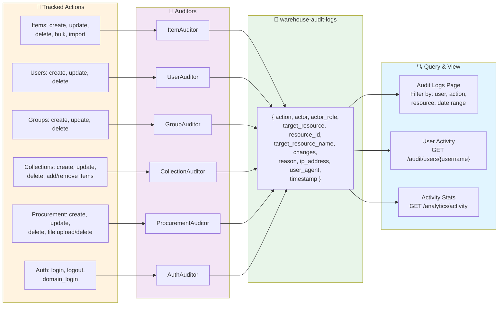
```mermaid
graph LR
    subgraph ACTIONS["🎯 Tracked Actions"]
        A1["Items: create, update,<br/>delete, bulk, import"]
        A2["Users: create, update, delete"]
        A3["Groups: create, update, delete"]
        A4["Collections: create, update,<br/>delete, add/remove items"]
        A5["Procurement: create, update,<br/>delete, file upload/delete"]
        A6["Auth: login, logout,<br/>domain_login"]
    end

    subgraph AUDITORS["📝 Auditors"]
        AU1["ItemAuditor"]
        AU2["UserAuditor"]
        AU3["GroupAuditor"]
        AU4["CollectionAuditor"]
        AU5["ProcurementAuditor"]
        AU6["AuthAuditor"]
    end

    subgraph LOG["💾 warehouse-audit-logs"]
        RECORD["{ action, actor, actor_role,<br/>target_resource, resource_id,<br/>target_resource_name, changes,<br/>reason, ip_address, user_agent,<br/>timestamp }"]
    end

    subgraph QUERY["🔍 Query & View"]
        LOGS_PAGE["Audit Logs Page<br/>Filter by: user, action,<br/>resource, date range"]
        USER_ACTIVITY["User Activity<br/>GET /audit/users/{username}"]
        ANALYTICS["Activity Stats<br/>GET /analytics/activity"]
    end

    A1 --> AU1
    A2 --> AU2
    A3 --> AU3
    A4 --> AU4
    A5 --> AU5
    A6 --> AU6

    AU1 --> RECORD
    AU2 --> RECORD
    AU3 --> RECORD
    AU4 --> RECORD
    AU5 --> RECORD
    AU6 --> RECORD

    RECORD --> LOGS_PAGE
    RECORD --> USER_ACTIVITY
    RECORD --> ANALYTICS

    style ACTIONS fill:#fff3e0
    style AUDITORS fill:#f3e5f5
    style LOG fill:#e8f5e9
    style QUERY fill:#e1f5ff
```

---

## 🔄 Undo/Redo System

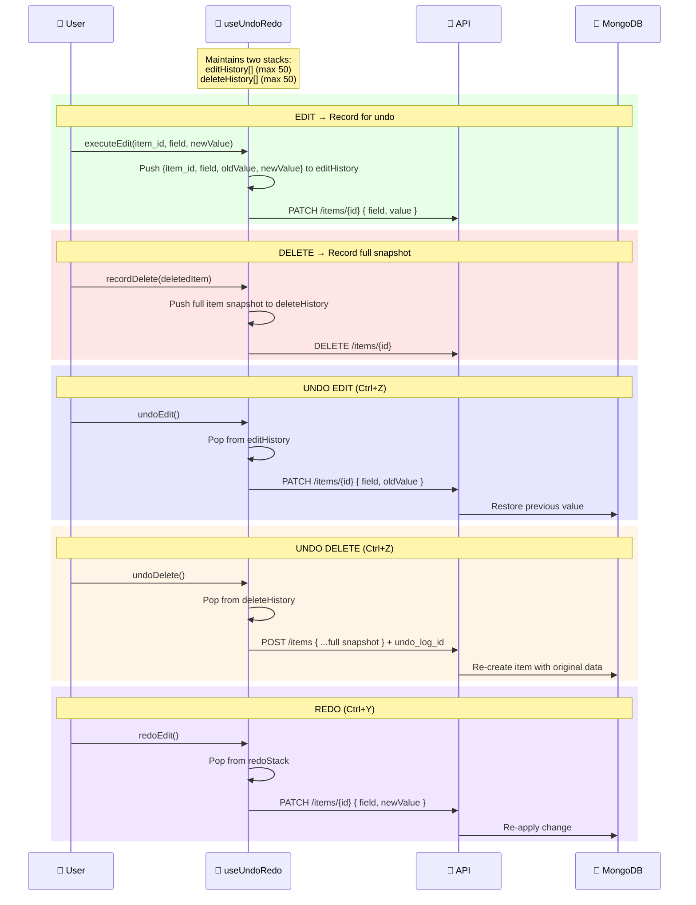
```mermaid
sequenceDiagram
    participant User as 👤 User
    participant Hook as 🔄 useUndoRedo
    participant API as 🔗 API
    participant DB as 💾 MongoDB

    Note over Hook: Maintains two stacks:<br/>editHistory[] (max 50)<br/>deleteHistory[] (max 50)

    rect rgb(230, 255, 230)
        Note over User,DB: EDIT → Record for undo
        User->>Hook: executeEdit(item_id, field, newValue)
        Hook->>Hook: Push {item_id, field, oldValue, newValue} to editHistory
        Hook->>API: PATCH /items/{id} { field, value }
    end

    rect rgb(255, 230, 230)
        Note over User,DB: DELETE → Record full snapshot
        User->>Hook: recordDelete(deletedItem)
        Hook->>Hook: Push full item snapshot to deleteHistory
        Hook->>API: DELETE /items/{id}
    end

    rect rgb(230, 230, 255)
        Note over User,DB: UNDO EDIT (Ctrl+Z)
        User->>Hook: undoEdit()
        Hook->>Hook: Pop from editHistory
        Hook->>API: PATCH /items/{id} { field, oldValue }
        API->>DB: Restore previous value
    end

    rect rgb(255, 245, 230)
        Note over User,DB: UNDO DELETE (Ctrl+Z)
        User->>Hook: undoDelete()
        Hook->>Hook: Pop from deleteHistory
        Hook->>API: POST /items { ...full snapshot } + undo_log_id
        API->>DB: Re-create item with original data
    end

    rect rgb(240, 230, 255)
        Note over User,DB: REDO (Ctrl+Y)
        User->>Hook: redoEdit()
        Hook->>Hook: Pop from redoStack
        Hook->>API: PATCH /items/{id} { field, newValue }
        API->>DB: Re-apply change
    end
```

---

## 📱 State Management Overview

```
┌─────────────────────────────────────────────────────────────┐
│              ⚛️ React State Management Stack                 │
├─────────────────────────────────────────────────────────────┤
│                                                              │
│  LOCAL STORAGE (Persistent)                                  │
│  ├── theme_mode: 'dark' | 'light'                           │
│  ├── theme_variant: 'normal' | 'wood' | 'space'             │
│  └── column_visibility: { col: boolean }                     │
│              ↑                                               │
│  CONTEXT API (Global + Reactive)                             │
│  ├── AuthContext                                             │
│  │   ├── user: { username, role, permissions, groups }       │
│  │   ├── isAuthenticated, isAdmin, isSuperAdmin              │
│  │   ├── hasPermission(), hasVendorAccess()                  │
│  │   ├── hasPricePermission(), hasProcurementAccess()        │
│  │   └── login(), logout()                                   │
│  │                                                           │
│  ├── ThemeContext                                             │
│  │   ├── mode, variant                                       │
│  │   └── toggleMode(), setVariant()                          │
│  │                                                           │
│  └── ToastContext                                             │
│      ├── toasts: [{ id, message, type }]                     │
│      └── success(), error(), info(), warning()               │
│              ↑                                               │
│  REACT QUERY (Server State Cache)                            │
│  ├── ['items', filters] → Inventory data                     │
│  ├── ['stale-items', days] → Stale items                     │
│  ├── ['catalog', filters] → Catalog (30s cache)              │
│  ├── ['orders', filters] → Procurement orders                │
│  ├── ['collections'] → User collections                      │
│  ├── ['collection-items', id] → Items in collection          │
│  ├── ['dashboard'] → Analytics (5-min cache)                 │
│  ├── ['audit-logs'] → Audit entries                          │
│  └── Automatic cache invalidation on mutations               │
│              ↑                                               │
│  COMPONENT STATE (useState / useReducer)                     │
│  ├── Form inputs and validation errors                       │
│  ├── Modal open/close (useInventoryModals, useProcModals)    │
│  ├── Selected table rows (useInventorySelection)             │
│  ├── Current page / items per page (usePagination)           │
│  ├── Undo/redo stacks (useUndoRedo)                          │
│  ├── Column resize state (useColumnResize)                   │
│  ├── Active cell editing (useCellEditing)                    │
│  └── Context menu position + target (useContextMenu)         │
│                                                              │
│  DATA FLOW                                                   │
│  User Action → Component State Updates → API Call (if needed)│
│          → React Query Cache Updated → Component Re-renders  │
│          → Optional: Persist to Context / localStorage       │
│                                                              │
└─────────────────────────────────────────────────────────────┘
```

---

## 🔒 Permission Check Flow

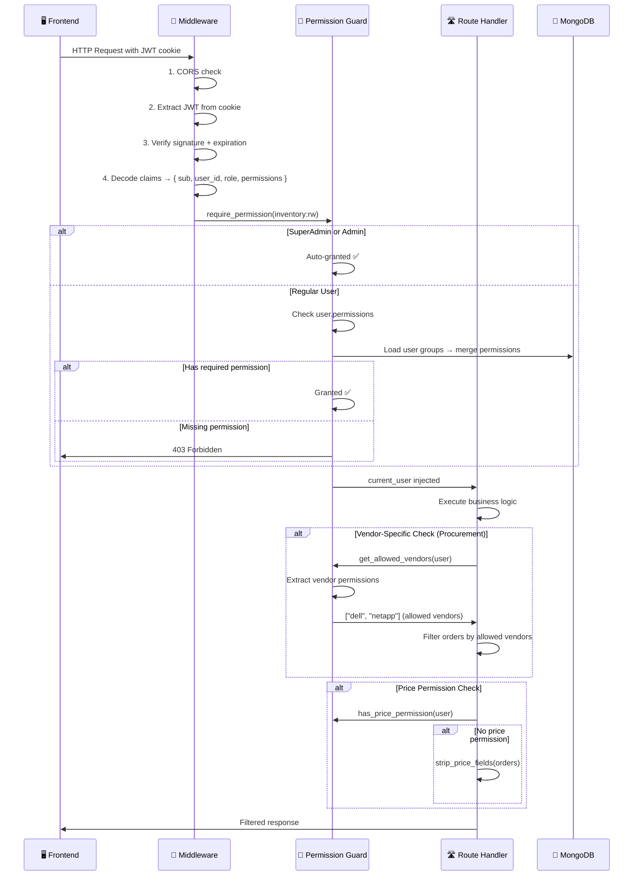
```mermaid
sequenceDiagram
    participant Client as 🖥️ Frontend
    participant MW as 🔧 Middleware
    participant Guard as 🔐 Permission Guard
    participant Route as 🛣️ Route Handler
    participant DB as 💾 MongoDB

    Client->>MW: HTTP Request with JWT cookie

    MW->>MW: 1. CORS check
    MW->>MW: 2. Extract JWT from cookie
    MW->>MW: 3. Verify signature + expiration
    MW->>MW: 4. Decode claims → { sub, user_id, role, permissions }

    MW->>Guard: require_permission(inventory:rw)

    alt SuperAdmin or Admin
        Guard->>Guard: Auto-granted ✅
    else Regular User
        Guard->>Guard: Check user.permissions
        Guard->>DB: Load user groups → merge permissions
        alt Has required permission
            Guard->>Guard: Granted ✅
        else Missing permission
            Guard->>Client: 403 Forbidden
        end
    end

    Guard->>Route: current_user injected
    Route->>Route: Execute business logic

    alt Vendor-Specific Check (Procurement)
        Route->>Guard: get_allowed_vendors(user)
        Guard->>Guard: Extract vendor permissions
        Guard->>Route: ["dell", "netapp"] (allowed vendors)
        Route->>Route: Filter orders by allowed vendors
    end

    alt Price Permission Check
        Route->>Guard: has_price_permission(user)
        alt No price permission
            Route->>Route: strip_price_fields(orders)
        end
    end

    Route->>Client: Filtered response
```

---

## 🌐 Request-Response Lifecycle

```
TIME
 ↓
 ├─ T0: Frontend generates request
 │   ├─ Axios client prepares request
 │   ├─ Adds withCredentials (cookie)
 │   └─ Serializes params
 │
 ├─ T1: Network transmission (~50-200ms)
 │
 ├─ T2: FastAPI receives request
 │   ├─ CORS preflight (if needed)
 │   ├─ GZip negotiation
 │   └─ Parse JSON body / form data
 │
 ├─ T3: Middleware stack
 │   ├─ JWT verification from cookie
 │   ├─ Rate limit check
 │   ├─ Request logging (method, path, IP)
 │   └─ Process timer starts
 │
 ├─ T4: Route handler
 │   ├─ Permission guard (Depends)
 │   ├─ Pydantic input validation
 │   └─ Dependency injection (service, repo)
 │
 ├─ T5: Service layer
 │   ├─ Business logic
 │   ├─ Cross-service calls (e.g., catalog update)
 │   └─ Audit logging
 │
 ├─ T6: Repository → MongoDB
 │   ├─ Execute query / aggregation
 │   └─ Return documents
 │
 ├─ T7: Response preparation
 │   ├─ Pydantic serialization
 │   ├─ GZip compression (if > 1KB)
 │   └─ Add X-Process-Time header
 │
 ├─ T8: Network transmission (~50-200ms)
 │
 ├─ T9: Frontend receives response
 │   ├─ Axios interceptor checks status
 │   ├─ 401 → redirect to /login
 │   └─ Parse JSON
 │
 ├─ T10: React Query
 │   ├─ Update cache
 │   ├─ Invalidate related queries
 │   └─ Trigger re-render
 │
 ├─ T11: UI update
 │   ├─ Close modals
 │   ├─ Show toast notification
 │   └─ Refresh table/charts
 │
 └─ Total: ~200ms-2s depending on complexity
```

---

## 👥 Admin User Management Flow

```mermaid
graph TB
    subgraph ADMIN["👨‍💼 Admin Panel — /admin"]
        TABS["Tabs: Users | Groups | AI Tools"]
    end

    subgraph USERS["👥 User Management"]
        LIST_U["List all users<br/>GET /admin/users"]
        CREATE_U["Create user<br/>POST /admin/users"]
        EDIT_U["Edit user<br/>PUT /admin/users/{id}"]
        DELETE_U["Delete user<br/>DELETE /admin/users/{id}"]
        STATS["User stats<br/>GET /admin/stats"]
    end

    subgraph GROUPS["👥 Group Management"]
        LIST_G["List all groups<br/>GET /admin/groups"]
        CREATE_G["Create group<br/>POST /admin/groups"]
        EDIT_G["Edit group<br/>PUT /admin/groups/{id}"]
        DELETE_G["Delete group<br/>DELETE /admin/groups/{id}"]
    end

    subgraph AI_TOOLS["🤖 AI Tools (SuperAdmin only)"]
        RETRAIN["Retrain classifier<br/>POST /api/ai/retrain"]
    end

    subgraph CONSTRAINTS["⚠ Business Rules"]
        C1["Cannot delete last Admin"]
        C2["Cannot delete SuperAdmin"]
        C3["Can only create lower-role users"]
        C4["All actions fully audited"]
    end

    ADMIN --> USERS
    ADMIN --> GROUPS
    ADMIN --> AI_TOOLS

    USERS --> LIST_U
    USERS --> CREATE_U
    USERS --> EDIT_U
    USERS --> DELETE_U
    USERS --> STATS

    GROUPS --> LIST_G
    GROUPS --> CREATE_G
    GROUPS --> EDIT_G
    GROUPS --> DELETE_G

    DELETE_U --> C1
    DELETE_U --> C2
    CREATE_U --> C3
    EDIT_U --> C4

    style ADMIN fill:#e1f5ff
    style USERS fill:#f3e5f5
    style GROUPS fill:#e8f5e9
    style AI_TOOLS fill:#fff3e0
    style CONSTRAINTS fill:#fce4ec
```

---

## 📊 Dashboard Data Flow

```mermaid
sequenceDiagram
    participant User as 👤 User
    participant Page as 📊 DashboardPage
    participant Hook as 📦 useAnalytics
    participant RQ as 🔄 React Query
    participant API as 🔗 GET /api/analytics/dashboard
    participant Service as 📋 AnalyticsService
    participant DB as 💾 MongoDB

    User->>Page: Navigate to /dashboard
    Page->>Page: Render date filter (optional)

    Page->>Hook: useDashboardStats({ start_date, end_date })
    Hook->>RQ: useQuery(['dashboard', dates], fetchFn, { staleTime: 5min })

    alt Cache hit (< 5 min old)
        RQ->>Hook: Cached data
    else Cache miss
        RQ->>API: GET /api/analytics/dashboard?start_date=...&end_date=...
        API->>Service: get_dashboard_stats(start, end)

        par Parallel aggregations
            Service->>DB: Count total items
            Service->>DB: Count serial vs non-serial
            Service->>DB: Aggregate project distribution (deduped)
            Service->>DB: Aggregate target sites
            Service->>DB: Aggregate manufacturers
            Service->>DB: Aggregate locations
            Service->>DB: Count active allocations
            Service->>DB: Procurement KPIs (filtered by date)
        end

        DB->>Service: All aggregation results
        Service->>API: Complete dashboard stats
        API->>RQ: 200 OK
        RQ->>RQ: Cache response
    end

    RQ->>Hook: Data ready
    Hook->>Page: { stats, isLoading: false }

    Page->>Page: Render KPI cards (inventory + procurement)
    Page->>Page: Render charts (projects, sites, mfgs, locations, activity)

    User->>Page: Change date filter
    Page->>Hook: New date params
    Hook->>RQ: Invalidate + refetch
```

---

## 🔍 Filter & Search Flow

```
┌─────────────────────────────────────────────────────────────┐
│              🔍 Advanced Filter & Search                     │
├─────────────────────────────────────────────────────────────┤
│                                                              │
│  USER INPUT                                                  │
│  ├─ Global search: "SFP 100G"                               │
│  ├─ Column filters:                                          │
│  │   ├─ catalog_number: "X-SFP"                             │
│  │   ├─ manufacturer: "NetApp"                               │
│  │   └─ location: "מחסן מרכזי"                               │
│  ├─ Sort: updated_at descending                              │
│  └─ Pagination: page=2, limit=30                             │
│              ↓                                               │
│  DEBOUNCE (useDebounce: ~300ms)                              │
│              ↓                                               │
│  BUILD QUERY PARAMS                                          │
│  GET /api/items?                                             │
│    search=SFP+100G&                                          │
│    catalog_number=X-SFP&                                     │
│    manufacturer=NetApp&                                      │
│    location=מחסן+מרכזי&                                      │
│    sort_by=updated_at&sort_order=desc&                        │
│    page=2&limit=30                                           │
│              ↓                                               │
│  REACT QUERY                                                 │
│  queryKey: ['items', { search, filters, sort, page }]        │
│  → Cache check → API call if stale                           │
│              ↓                                               │
│  BACKEND                                                     │
│  ├─ Build MongoDB query with $regex / $and                   │
│  ├─ Apply sort                                               │
│  ├─ Count total matching                                     │
│  ├─ Apply skip + limit                                       │
│  └─ Return { items, total, page, pages }                     │
│              ↓                                               │
│  RENDER                                                      │
│  ├─ ItemTable with filtered data                             │
│  ├─ Pagination: "עמוד 2 מתוך 8"                              │
│  ├─ Active filter indicators                                 │
│  └─ Clear filters button                                     │
│                                                              │
└─────────────────────────────────────────────────────────────┘
```
