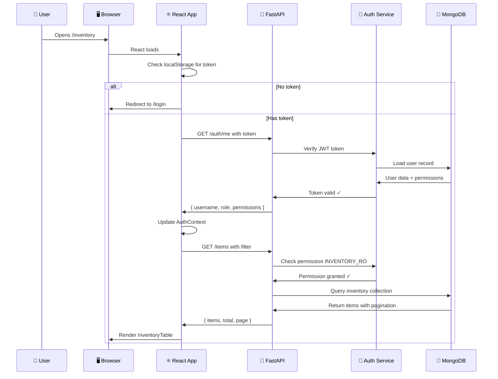
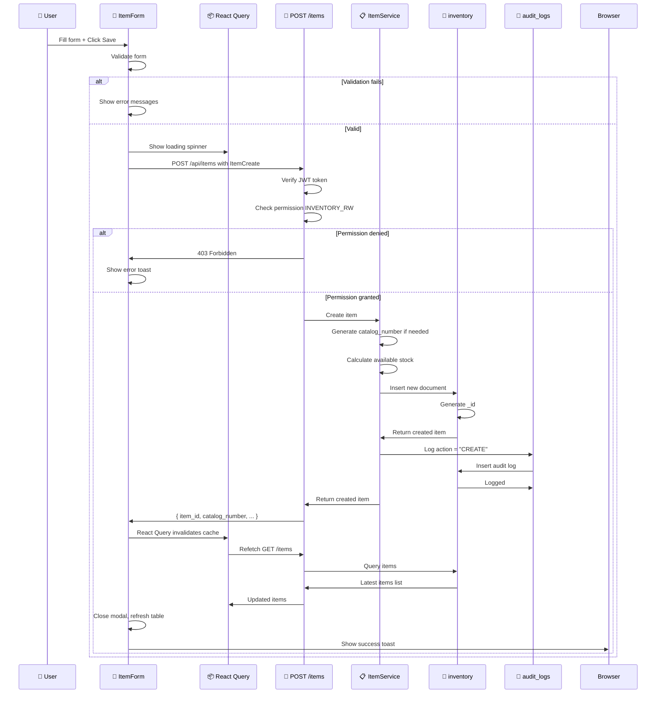
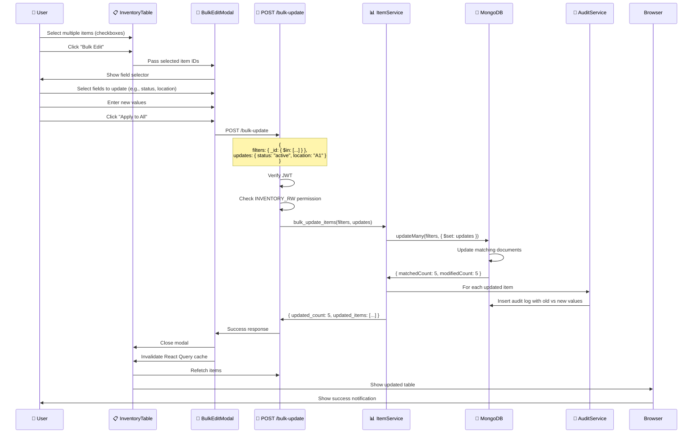
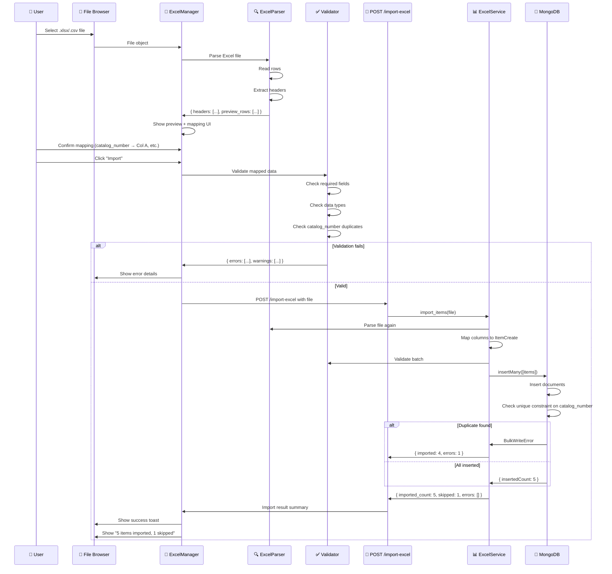
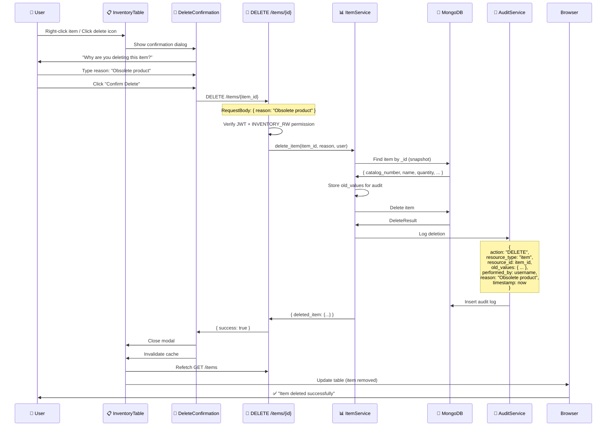
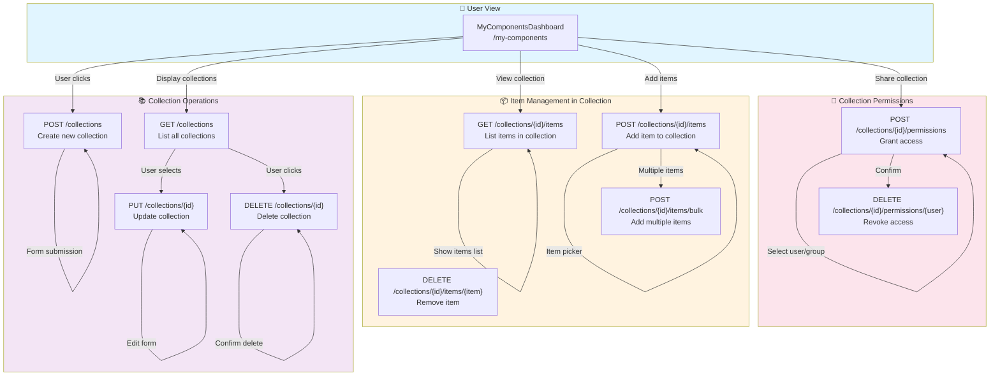
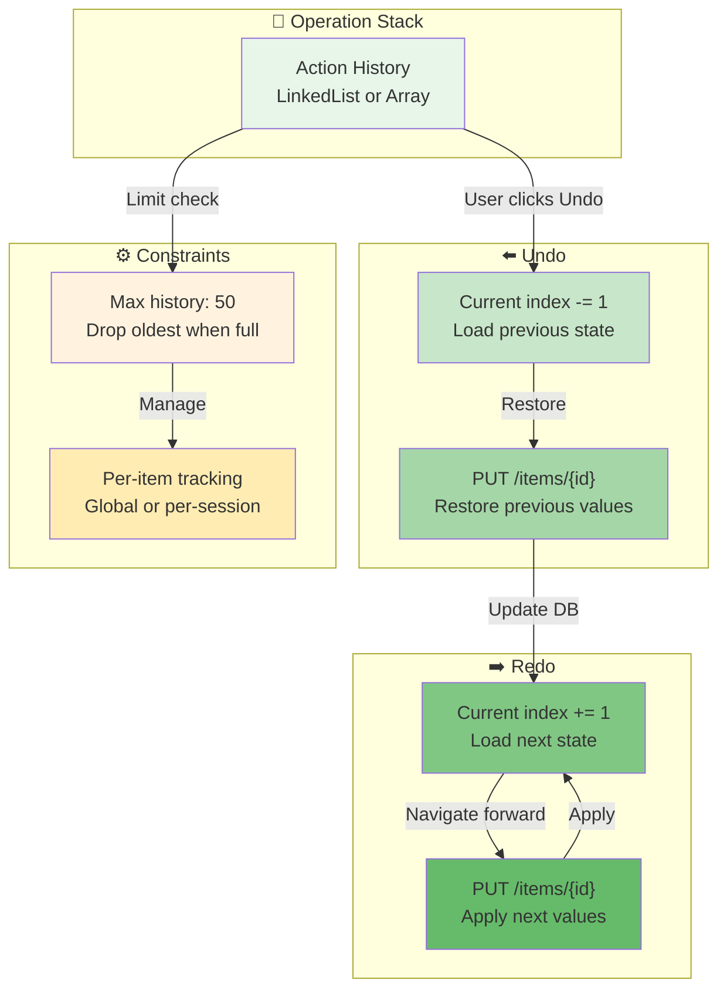

# 🔄 Data Flow & Interaction Diagrams

## 📊 System-wide Communication Flow



---

## 🆕 Create Item Flow (Complete)



---

## ✏️ Bulk Update Flow



---

## 📥 Import Excel Flow (Detailed)



---

## 🔐 Login & Token Lifecycle

```mermaid
graph LR
    A["🔓 User at Login<br/>/login"] -->|username, password| B["🖥️ POST /auth/login"]
    B -->|Validate| C["🔍 Query users collection<br/>Find by username"]
    C -->|User exists?| D{Check Password}
    D -->|❌ Wrong| E["⛔ 401 Unauthorized"]
    E -->|Show error| A
    D -->|✅ Correct| F["🔑 Create JWT Token"]
    F -->|Claims| G["token = JWT<br/>sub: username<br/>user_id: id<br/>role: admin<br/>permissions: [...]<br/>exp: now + 240min"]
    G -->|Return| H["📦 Response:<br/>{access_token, token_type}"]
    H -->|Store| I["💾 localStorage<br/>authToken"]
    I -->|Redirect| J["📄 /dashboard"]
    J -->|GET /auth/me<br/>Header: Auth Bearer| K["🔍 Verify JWT"]
    K -->|Valid| L["📋 Return user info"]
    L -->|Update| M["🔐 AuthContext<br/>isAuthenticated = true"]
    M -->|Protected routes| N["✅ Access granted"]
    
    style A fill:#e1f5ff
    style B fill:#f3e5f5
    style D fill:#fff3e0
    style F fill:#e8f5e9
    style I fill:#fce4ec
    style N fill:#c8e6c9
```



---

## 🗑️ Delete Item Flow (with Audit)



---

## 👥 Admin User Management Flow

```mermaid
graph TB
    A["👨‍💼 Admin User"] -->|Click Admin Panel| B["📊 AdminPage"]
    B -->|Navigate to Users| C["👥 UserManagement"]
    C -->|GET /admin/users| D["📋 API"]
    D -->|Check: Admin role| E{Permission Check}
    E -->|✅ Granted| F["Query users collection"]
    E -->|❌ Denied| G["⛔ 403 Error"]
    F -->|Paginated list| H["📋 UserTable"]
    H -->|Display| C
    
    A -->|Click 'Edit User'| I["✏️ Edit user: john.doe"]
    I -->|Change role admin→user| J["Update form"]
    J -->|Revoke permissions| K["Select permissions"]
    J -->|Submit| L["PUT /admin/users/{id}"]
    L -->|Validate| M["Check admin permission"]
    M -->|✅ Valid| N["Update user document"]
    N -->|Log action| O["📝 Audit log:<br/>who, what, when, why"]
    O -->|Return| P["Updated user"]
    P -->|Refresh| H
    
    A -->|Click 'Delete User'| Q["🗑️ Delete Confirmation"]
    Q -->|Enter reason| R["Reason: Left company"]
    R -->|DELETE /admin/users/{id}| S["Backend deletes user"]
    S -->|Log deletion| O
    S -->|Response| T["✅ User deleted"]
    T -->|Refresh| H
    
    style A fill:#e1f5ff
    style B fill:#fff3e0
    style C fill:#f3e5f5
    style E fill:#fce4ec
    style H fill:#e8f5e9
    style O fill:#ffebee
```

---

## 🏷️ Collections Management



---

## 📊 Filter & Search Flow

```
┌─────────────────────────────────────────────────────────────┐
│              🔍 Advanced Filter & Search Flow               │
├─────────────────────────────────────────────────────────────┤
│                                                              │
│  USER INPUT                                                  │
│  ├─ Search box: "LED 5mm"                                   │
│  ├─ Filter by:                                              │
│  │  ├─ Category dropdown                                    │
│  │  ├─ Status checkbox                                      │
│  │  ├─ Location multi-select                                │
│  │  └─ Quantity range slider                                │
│  ├─ Sort: "Price: High to Low"                              │
│  └─ Pagination: Page 3, 50 items/page                       │
│        ↓                                                     │
│  BUILD QUERY                                                │
│  ├─ Filter: { category: "LED", status: "active" }           │
│  ├─ Text Search: { $text: { $search: "5mm" } }              │
│  ├─ Range: { quantity: { $gte: 10, $lte: 100 } }            │
│  └─ Sort: { price: -1 }                                     │
│        ↓                                                     │
│  API CALL                                                    │
│  GET /api/items?                                            │
│    filter={"category":"LED"}&                               │
│    search="5mm"&                                            │
│    sort=-price&                                             │
│    page=3&                                                  │
│    limit=50                                                 │
│        ↓                                                     │
│  BACKEND PROCESSING                                         │
│  ├─ Parse filters and sort                                  │
│  ├─ Execute MongoDB query                                   │
│  ├─ Count total matching documents                          │
│  ├─ Apply pagination: skip + limit                          │
│  └─ Return: { items, total, page, limit }                   │
│        ↓                                                     │
│  FRONTEND DISPLAY                                           │
│  ├─ Show filtered table                                     │
│  ├─ Display: "Showing 1-50 of 247"                          │
│  ├─ Enable "Next"/"Previous" buttons                        │
│  ├─ Highlight active filters                                │
│  └─ Show "Clear all" button                                 │
│                                                              │
│  SAVE FILTER (Optional)                                      │
│  ├─ Click "Save this filter"                                │
│  ├─ Enter name: "High value LED stock"                      │
│  ├─ Store in localStorage                                   │
│  └─ Load later with one click                               │
│                                                              │
└─────────────────────────────────────────────────────────────┘
```

---

## 📈 Permission Check Flow

```
┌──────────────────────────────────────────────────────────┐
│         🔒 Permission Validation at Each Request         │
├──────────────────────────────────────────────────────────┤
│                                                          │
│  CLIENT REQUEST                                          │
│  GET /api/items                                          │
│  Header: Authorization: Bearer eyJhbGc...               │
│              ↓                                           │
│  MIDDLEWARE 1: JWT VERIFICATION                         │
│  ├─ Extract token from header                           │
│  ├─ Verify signature with SECRET_KEY                    │
│  ├─ Check expiration                                    │
│  └─ Decode claims → payload                             │
│              ↓                                           │
│  EXTRACTED CLAIMS                                        │
│  {                                                      │
│    "sub": "john.doe",                                   │
│    "user_id": "507f...",                               │
│    "role": "user",                                      │
│    "permissions": ["INVENTORY_RO"],                     │
│    "exp": 1708123456                                    │
│  }                                                      │
│              ↓                                           │
│  ROUTE HANDLER: REQUIRES PERMISSION                      │
│  @router.get("/items")                                  │
│  async def get_items(                                   │
│    current_user = Depends(require_permission(           │
│      Permission.INVENTORY_RO                             │
│    ))                                                   │
│  )                                                      │
│              ↓                                           │
│  PERMISSION CHECK                                        │
│  ├─ Get required permission: INVENTORY_RO               │
│  ├─ Get user permissions: ["INVENTORY_RO"]              │
│  ├─ Check if INVENTORY_RO in permissions                │
│  └─ Result: ✅ ALLOWED                                   │
│              ↓                                           │
│  EXECUTE HANDLER                                         │
│  ├─ Query MongoDB                                       │
│  ├─ Return results                                      │
│  └─ 200 OK                                              │
│                                                          │
│  ━━━━━━━━━━━━━━━━━━━━━━━━━━━━━━━━━━━━━━━━━━━━━━━━━━   │
│  ALTERNATIVE: INSUFFICIENT PERMISSIONS                   │
│              ↓                                           │
│  PERMISSION CHECK FAILS                                  │
│  ├─ Get required permission: INVENTORY_RW               │
│  ├─ Get user permissions: ["INVENTORY_RO"]              │
│  ├─ Check if INVENTORY_RW in permissions                │
│  └─ Result: ❌ DENIED                                    │
│              ↓                                           │
│  RETURN ERROR                                            │
│  403 Forbidden                                           │
│  {                                                      │
│    "detail": "Not enough permissions",                  │
│    "required": "INVENTORY_RW",                          │
│    "user_permissions": ["INVENTORY_RO"]                 │
│  }                                                      │
│                                                          │
└──────────────────────────────────────────────────────────┘
```

---

## 🌐 Request-Response Lifecycle

```
TIME
 ↓
 ├─ T0: Frontend generates request
 │   ├─ Method: POST
 │   ├─ URL: /api/items
 │   ├─ Body: { catalog_number: "LED-001", ... }
 │   ├─ Headers: { Authorization: Bearer ..., Content-Type: application/json }
 │   └─ Size: ~500 bytes
 │
 ├─ T1: Network transmission
 │   └─ ~50-200ms (depending on network)
 │
 ├─ T2: Backend receives request
 │   ├─ CORS check (preflight if needed)
 │   ├─ Parse JSON body
 │   └─ Extract headers
 │
 ├─ T3: FastAPI middleware
 │   ├─ JWT token verification
 │   ├─ Rate limit check
 │   └─ Logging
 │
 ├─ T4: Route handler
 │   ├─ Permission check (INVENTORY_RW)
 │   ├─ Input validation (Pydantic)
 │   └─ Extract current_user from token
 │
 ├─ T5: Service layer
 │   ├─ Business logic (calculate available, etc.)
 │   ├─ Generate catalog_number if needed
 │   └─ Prepare for database
 │
 ├─ T6: Database operations
 │   ├─ Insert item document
 │   ├─ Generate ObjectId
 │   └─ Create audit log entry
 │
 ├─ T7: Response preparation
 │   ├─ Serialize to JSON
 │   ├─ Add GZIP compression (if > 1KB)
 │   ├─ Add headers: X-Process-Time, Content-Type
 │   └─ Size: ~400 bytes (or less with GZIP)
 │
 ├─ T8: Network transmission (response)
 │   └─ ~50-200ms
 │
 ├─ T9: Frontend receives response
 │   ├─ Status: 201 Created
 │   ├─ Body: { item_id, catalog_number, ... }
 │   └─ Headers: { Content-Type, X-Process-Time: "0.045s" }
 │
 ├─ T10: React Query
 │   ├─ Invalidate cache (GET /items)
 │   └─ Trigger refetch
 │
 ├─ T11: UI Update
 │   ├─ Close modal
 │   ├─ Show success toast
 │   └─ Refresh table with new item
 │
 └─ T12: Total time: ~1-2 seconds
    └─ Network: 0.1-0.4s
       Logic: 0.01-0.05s
       UI: 0.85-1.85s
```

---

## 🔄 Undo/Redo System Architecture



---

## 📱 State Management Overview

```
┌─────────────────────────────────────────────────────────────┐
│              ⚛️ React State Management Stack                 │
├─────────────────────────────────────────────────────────────┤
│                                                              │
│  LOCAL STORAGE                                               │
│  └─ authToken (JWT, persisted)                              │
│     theme preference (light/dark)                           │
│     saved filters                                            │
│     user preferences                                        │
│              ↑                                              │
│  CONTEXT API                                                 │
│  ├─ AuthContext                                             │
│  │  ├─ isAuthenticated: boolean                             │
│  │  ├─ user: { username, role, permissions }                │
│  │  ├─ loading: boolean                                     │
│  │  └─ methods: login(), logout(), hasPermission()          │
│  │                                                           │
│  ├─ ThemeContext                                            │
│  │  ├─ theme: 'light' | 'dark'                              │
│  │  └─ toggleTheme()                                        │
│  │                                                           │
│  └─ ToastContext                                            │
│     ├─ toasts: [{ id, type, message }]                      │
│     └─ methods: showToast(), removeToast()                  │
│              ↑                                              │
│  REACT QUERY (Server State)                                 │
│  ├─ GET /api/items → useQuery('items')                      │
│  │  ├─ data: items array                                    │
│  │  ├─ isLoading: boolean                                   │
│  │  ├─ error: error object                                  │
│  │  └─ methods: refetch(), invalidate()                     │
│  │                                                           │
│  ├─ GET /api/users → useQuery('users')                      │
│  │                                                           │
│  └─ GET /api/analytics/dashboard → useQuery('dashboard')    │
│              ↑                                              │
│  COMPONENT STATE (useState)                                 │
│  ├─ Form inputs                                             │
│  ├─ Modal open/close                                        │
│  ├─ Selected rows in table                                  │
│  ├─ Current page, filters                                   │
│  ├─ Pending uploads                                         │
│  └─ Temporary UI state                                      │
│                                                              │
│  DATA FLOW                                                   │
│  Component State → Component renders                         │
│         ↓                                                    │
│  User interaction → Updates state                            │
│         ↓                                                    │
│  API call if needed (React Query)                            │
│         ↓                                                    │
│  Cache updated → Component re-renders                        │
│         ↓                                                    │
│  Optional: Persist to Context/localStorage                  │
│                                                              │
└─────────────────────────────────────────────────────────────┘
```

---

## 🎯 Component Lifecycle in List View

```
MOUNT PHASE
    ↓
    └─ useEffect: GET /api/items
           ↓
    ├─ Show loading spinner
    ├─ React Query: isLoading = true
    └─ Fetch data from backend
           ↓
DATA RECEIVED
    ├─ React Query updates cache
    ├─ Component state: items = [...]
    └─ Render table with data
           ↓
USER INTERACTIONS
    ├─ Click "Edit" → ItemForm component mounts
    │  └─ useEffect: Fetch single item details
    ├─ Click "Delete" → DeleteConfirmation mounts
    │  └─ Confirm → DELETE /items/{id}
    │     └─ React Query invalidates 'items' query
    │        └─ Refetch triggered
    ├─ Change page → paginate() called
    │  └─ GET /items?page=2
    └─ Filter changed
       └─ GET /items?filter=...
           ↓
RE-RENDER
    ├─ Update table with new data
    ├─ Update pagination buttons
    └─ Scroll to top
           ↓
UNMOUNT
    └─ Cleanup subscriptions
```

---

**Generated**: 17-02-2026
**Architecture Version**: 2.0.0
