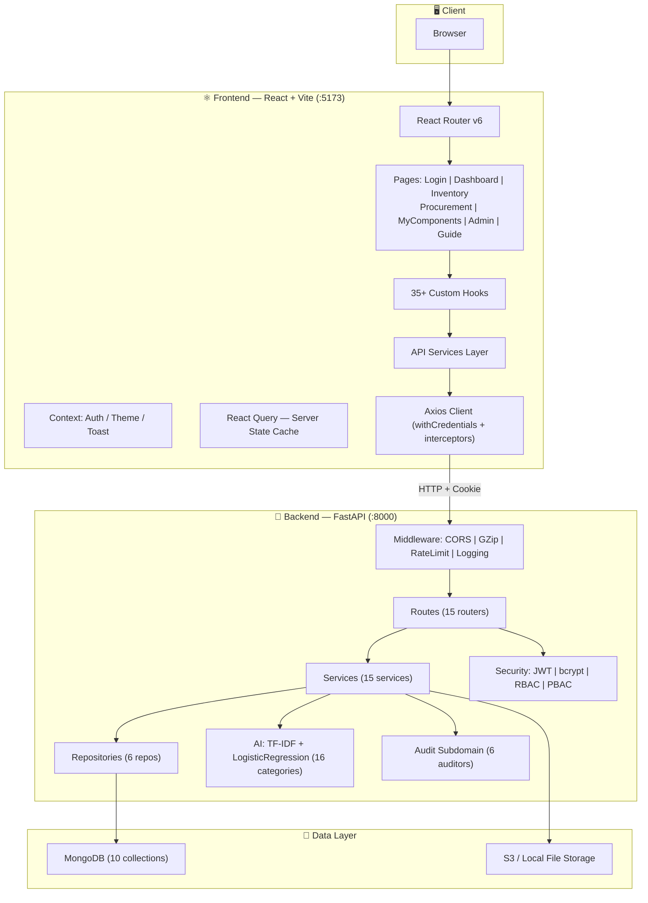

# 🏭 Warehouse Management System — מערכת ניהול מלאי

> מערכת מלאה לניהול מלאי ורכש ארגוני, בנויה על FastAPI + React + MongoDB עם ניהול הרשאות מתקדם, סיווג AI, ותיעוד ביקורת מלא.

---

## 📋 תוכן עניינים

1. [תיאור כללי](#תיאור-כללי)
2. [תכונות עיקריות](#תכונות-עיקריות)
3. [ארכיטקטורה](#ארכיטקטורה)
4. [טכנולוגיות](#טכנולוגיות)
5. [מבנה הפרויקט](#מבנה-הפרויקט)
6. [דרישות מוקדמות](#דרישות-מוקדמות)
7. [התקנה והפעלה](#התקנה-והפעלה)
8. [משתני סביבה](#משתני-סביבה)
9. [משתמשי פיתוח](#משתמשי-פיתוח)
10. [API Reference](#api-reference)
11. [מסד הנתונים](#מסד-הנתונים)
12. [אימות והרשאות](#אימות-והרשאות)
13. [מודול AI](#מודול-ai)
14. [תהליכי עבודה](#תהליכי-עבודה)
15. [בדיקות](#בדיקות)
16. [פריסה](#פריסה)
17. [אבטחה](#אבטחה)
18. [פתרון בעיות](#פתרון-בעיות)
19. [תיעוד נוסף](#תיעוד-נוסף)

---

## תיאור כללי

מערכת ניהול מלאי ורכש ארגונית מלאה הכוללת:

- **ניהול מלאי מתקדם** — CRUD, ייבוא/ייצוא Excel, עריכה מרובה, Undo/Redo
- **ניהול רכש** — הזמנות, ניהול קבצים, מעקב סטטוס, אינטגרציה עם BOM
- **ניהול משתמשים** — אימות מקומי + ADFS, תפקידים, הרשאות גרנולריות, קבוצות
- **AI/ML** — סיווג אוטומטי של רכיבי BOM ל-16 קטגוריות (TF-IDF + Logistic Regression)
- **ביקורת מלאה** — כל פעולה מתועדת עם Audit Trail מלא
- **דשבורד אנליטי** — KPIs, גרפים, פעילות אחרונה, התראות מלאי נמוך
- **אוספים/פרויקטים** — ניהול אוספי פריטים עם הרשאות Owner/RW/RO

---

## תכונות עיקריות

### 📦 ניהול מלאי

| תכונה | פרטים |
|--------|--------|
| CRUD מלא | יצירה, עריכה, מחיקה, צפייה בפריטים |
| חיפוש מתקדם | סינון רב-שכבתי: קטגוריה, ספק, מיקום, טקסט חופשי |
| ייבוא Excel | זיהוי חכם: serial vs. catalog+location |
| ייצוא Excel | ייצוא עם פילטרים |
| עריכה מרובה | Bulk Edit על פריטים מסומנים |
| מחיקה מרובה | Bulk Delete עם אישור |
| Undo/Redo | עד 50 פעולות לאחורה (עריכה ומחיקה בנפרד) |
| Column Visibility | בחירת עמודות להצגה, נשמר ב-localStorage |
| Stale Items | זיהוי פריטים ישנים ללא עדכון |

### 🛒 ניהול רכש

| תכונה | פרטים |
|--------|--------|
| הזמנות רכש | יצירה, עדכון, מחיקה, מעקב סטטוס |
| סטטוסים | pending → approved → in-transit → received |
| קבצים מצורפים | חשבוניות, Packing Lists (PDF, XLSX, JPG, DOC, עד 10MB) |
| BOM Scanner | סריקת קובץ BOM מספקים (NetApp/Dell/HPE/Cisco + Generic) |
| BOM Analytics | מעקב מחירים היסטורי, ניתוח ספקים, השוואת חוזים |
| תבניות BOM | ניהול תבניות ניתוחי BOM מותאמות אישית לכל ספק |

### 👥 ניהול משתמשים

| תכונה | פרטים |
|--------|--------|
| אימות מקומי | username + bcrypt password |
| אימות ADFS | Domain Login אוטומטי + יצירת משתמש AD |
| תפקידים | SuperAdmin > Admin > Manager > User > Procurement |
| הרשאות | granular per-resource, per-vendor |
| קבוצות | ירושת הרשאות מקבוצה |
| ניהול סיסמה | שינוי עצמי + Admin reset |
| יומן התחברויות | IP + User-Agent tracking |

### 📊 אנליטיקה ודשבורד

- KPIs: סה"כ פריטים, הזמנות פתוחות, מלאי נמוך, ערך מלאי
- תרשימים: פילוח פרויקטים, מיקומים, יצרנים
- פעילות אחרונה
- מעקב BOM Analytics (מחירים, ספקים, הנחות)

### 🎨 ממשק משתמש

- Responsive Design (mobile/tablet/desktop)
- Dark / Light Mode + variants (normal/wood/space)
- ממשק עברי מלא (RTL)
- Skeleton Loading
- Toast Notifications (auto-dismiss 5 שניות)
- Context Menu (קליק ימני)
- Keyboard Shortcuts (Ctrl+Z, Ctrl+Y ועוד)
- Inline Cell Editing
- Draggable Column Resize

---

## ארכיטקטורה



### שכבות Backend

```
┌──────────────────────────────────────────────────┐
│  Routes  (app/routes/)                           │
│  HTTP handling, dependency injection, guards      │
├──────────────────────────────────────────────────┤
│  Services  (app/services/)                        │
│  Business logic, validation, audit, orchestration │
├──────────────────────────────────────────────────┤
│  Repositories  (app/db/repositories/)             │
│  MongoDB queries, aggregations, CRUD              │
├──────────────────────────────────────────────────┤
│  Schemas  (app/schemas/)                          │
│  Pydantic models — request/response validation    │
├──────────────────────────────────────────────────┤
│  Core  (app/core/)                               │
│  JWT, bcrypt, RBAC, constants, exceptions         │
└──────────────────────────────────────────────────┘
```

---

## טכנולוגיות

### Backend

| חבילה | גרסה | שימוש |
|-------|-------|-------|
| `fastapi` | latest | Web framework |
| `uvicorn` | latest | ASGI Server |
| `motor` | latest | Async MongoDB driver |
| `pydantic` + `pydantic-settings` | latest | Validation & config |
| `python-jose[cryptography]` | latest | JWT tokens |
| `passlib[bcrypt]` | latest | Password hashing |
| `slowapi` | latest | Rate limiting |
| `pandas` + `openpyxl` | latest | Excel processing |
| `scikit-learn` | 1.7.2 | AI classifier |
| `joblib` | ≥1.3.0 | Model serialization |
| `boto3` | latest | S3 file storage |
| `httpx` | latest | HTTP client (ADFS) |
| `python-multipart` | latest | File uploads |

### Frontend

| חבילה | גרסה | שימוש |
|-------|-------|-------|
| `react` | ^18.2.0 | UI framework |
| `react-router-dom` | ^7.12.0 | Client-side routing |
| `@tanstack/react-query` | ^5.90.20 | Server state management |
| `axios` | ^1.13.2 | HTTP client |
| `recharts` | ^3.7.0 | Charts & graphs |
| `react-icons` | ^5.5.0 | Icon library |
| `react-window` | ^2.2.5 | Virtual scrolling |
| `xlsx` | ^0.18.5 | Excel client-side parsing |
| `vite` | ^5.4.21 | Build tool |
| `vitest` | ^4.1.4 | Unit testing |
| `@playwright/test` | ^1.58.2 | E2E testing |

### Infrastructure

| כלי | שימוש |
|-----|-------|
| Docker | Containerization |
| Kubernetes + Helm | Orchestration |
| Nginx | Reverse proxy / Frontend serving |
| MongoDB | Primary database |
| S3 / MinIO | File storage (optional) |

---

## מבנה הפרויקט

```
warehouse/
├── backend/
│   ├── app/
│   │   ├── main.py              # FastAPI app + middleware setup
│   │   ├── config.py            # Settings (pydantic-settings)
│   │   ├── dependencies.py      # DI factory functions
│   │   ├── ai/
│   │   │   ├── classifier.py            # TF-IDF + LogReg model
│   │   │   └── component_classifier.py  # Category enrichment
│   │   ├── core/
│   │   │   ├── security.py      # JWT creation/verification
│   │   │   ├── password.py      # bcrypt helpers
│   │   │   ├── constants.py     # Roles, permissions
│   │   │   ├── exceptions.py    # Custom HTTP exceptions
│   │   │   ├── logger.py        # Structured logging
│   │   │   ├── limiter.py       # Rate limiter (slowapi)
│   │   │   └── excel_parser.py  # Excel parsing utilities
│   │   ├── db/
│   │   │   ├── mongodb.py       # Motor client + connection
│   │   │   ├── repositories/    # Data access layer (6 repos)
│   │   │   └── utils/           # DB helpers
│   │   ├── routes/api/          # 15 route modules
│   │   ├── schemas/             # 10 Pydantic schema files
│   │   └── services/            # 15 service modules
│   │       └── audit/           # 6 specialized auditors
│   ├── tests/
│   │   ├── unit/                # Unit tests
│   │   └── integration/         # Integration tests
│   ├── migrations/              # DB migration scripts
│   ├── scripts/                 # Utility scripts (indexes, seed)
│   ├── requirements.txt
│   ├── run.py                   # Entry point
│   └── Dockerfile
│
├── frontend/
│   ├── src/
│   │   ├── App.jsx              # Root + providers
│   │   ├── router.jsx           # Route definitions + guards
│   │   ├── api/services/        # 12 API service modules
│   │   ├── components/
│   │   │   ├── common/          # Reusable UI primitives
│   │   │   ├── inventory/       # Inventory-specific components
│   │   │   ├── procurement/     # Procurement components + BOM
│   │   │   ├── dashboard/       # Dashboard charts & cards
│   │   │   ├── admin/           # Admin panel components
│   │   │   ├── MyComponents/    # Collections components
│   │   │   └── logs/            # Audit log components
│   │   ├── context/             # Auth, Theme, Toast providers
│   │   ├── hooks/               # 35+ custom hooks
│   │   ├── pages/               # Top-level page components
│   │   ├── constants/           # App-wide constants
│   │   ├── utils/               # Helper functions
│   │   └── styles/              # Global CSS
│   ├── tests/
│   │   ├── e2e/                 # Playwright E2E tests
│   │   └── fixtures/
│   ├── package.json
│   ├── vite.config.js
│   ├── vitest.config.js
│   └── playwright.config.js
│
├── helm/                        # Kubernetes Helm chart
│   ├── Chart.yaml
│   ├── values.yaml
│   └── templates/
│
├── ARCHITECTURE.md
├── API_REFERENCE.md
├── DATA_FLOW_DIAGRAMS.md
├── FRONTEND_COMPONENTS.md
├── BE_TESTS_REQUIRED.md
├── FE_TESTS_REQUIRED.md
└── README.md
```

---

## דרישות מוקדמות

```
Python     3.11+
Node.js    18+
MongoDB    5.0+
Git
Docker     (אופציונלי, לפריסה מקומית)
```

---

## התקנה והפעלה

### 1. Backend

```bash
cd backend

# יצירת virtual environment
python -m venv .venv

# Windows:
.venv\Scripts\activate
# Linux/Mac:
source .venv/bin/activate

# התקנת תלויות
pip install -r requirements.txt

# הגדרת משתני סביבה
copy .env.example .env   # Windows
cp .env.example .env     # Linux/Mac
# ערוך את .env לפי ההגדרות שלך

# הפעלה
python run.py
```

Backend זמין ב: **http://localhost:8000**
Swagger UI: **http://localhost:8000/docs**

### 2. Frontend

```bash
cd frontend

# התקנת תלויות
npm install

# הפעלה במצב פיתוח
npm run dev
```

Frontend זמין ב: **http://localhost:5173**

### 3. Docker Compose (כל המערכת)

```bash
# בניית images
docker-compose build

# הפעלה
docker-compose up -d

# עצירה
docker-compose down
```

| שירות | כתובת |
|-------|-------|
| Frontend | http://localhost:3000 |
| Backend | http://localhost:8000 |
| MongoDB | localhost:27017 |

### 4. Seed נתוני פיתוח (אופציונלי)

```bash
cd backend

# יצירת משתמשי test
python scripts/seed_test_users.py

# יצירת indexes
python scripts/create_indexes.py

# seed היסטוריה
python seed_history.py
```

---

## משתני סביבה

### Backend (`backend/.env`)

```env
# ===== MongoDB =====
MONGODB_URL=mongodb://localhost:27017
DB_NAME=warehouse

# ===== JWT =====
SECRET_KEY=your-very-secure-secret-key-here
ALGORITHM=HS256
ACCESS_TOKEN_EXPIRE_MINUTES=240

# ===== CORS =====
CORS_ORIGINS=["http://localhost:3000","http://localhost:5173"]

# ===== Environment =====
ENVIRONMENT=development

# ===== File Storage =====
USE_S3=false
S3_BUCKET_NAME=
S3_REGION=
S3_ACCESS_KEY=
S3_SECRET_KEY=
S3_ENDPOINT_URL=

# ===== ADFS (Domain Login) =====
ADFS_LOGIN_URL=
ADFS_TOKEN_INFO_URL=
ADFS_VALIDATE_URL=
```

### Frontend (`frontend/.env`)

```env
VITE_API_URL=http://localhost:8000
VITE_APP_NAME=Warehouse System
```

---

## משתמשי פיתוח

> ⚠️ **חשוב:** שנה את הסיסמאות בסביבת Production!

| Username | Password | Role | הרשאות |
|----------|----------|------|--------|
| `admin` | `password` | Admin | כל ההרשאות |
| `manager` | `password` | Manager | INVENTORY_RW, PROCUREMENT_RO |
| `user` | `password` | User | INVENTORY_RO |
| `procurement` | `password` | Procurement | PROCUREMENT_RW |

---

## API Reference

### Authentication

```
POST   /api/auth/login            # התחברות מקומית
POST   /api/auth/domain-login     # התחברות ADFS
POST   /api/auth/logout           # התנתקות
GET    /api/auth/me               # מידע משתמש נוכחי
PUT    /api/auth/password         # שינוי סיסמה
```

### Inventory

```
GET    /api/items                 # רשימת פריטים (עם פילטרים)
POST   /api/items                 # יצירת פריט
PATCH  /api/items/{id}            # עדכון פריט
DELETE /api/items/{id}            # מחיקת פריט
POST   /api/items/bulk-update     # עדכון מרובה
POST   /api/items/bulk-delete     # מחיקה מרובה
GET    /api/items/stale           # פריטים ישנים
GET    /api/items/{id}/collections # אוספים של פריט
```

### Excel

```
POST   /api/excel/import-excel    # ייבוא קובץ Excel
GET    /api/excel/export-excel    # ייצוא לExcel
POST   /api/excel/import-projects # ייבוא הקצאות פרויקטים
```

### Procurement

```
GET    /api/procurement/orders             # רשימת הזמנות
POST   /api/procurement/orders             # יצירת הזמנה
PUT    /api/procurement/orders/{id}        # עדכון הזמנה
DELETE /api/procurement/orders/{id}        # מחיקת הזמנה
POST   /api/procurement/orders/{id}/files  # העלאת קובץ
GET    /api/procurement/orders/{id}/files/{fid} # הורדת קובץ
DELETE /api/procurement/orders/{id}/files/{fid} # מחיקת קובץ
```

### Collections

```
GET    /api/collections                      # כל האוספים שלי
POST   /api/collections                      # יצירת אוסף
PUT    /api/collections/{id}                 # עדכון אוסף
DELETE /api/collections/{id}                 # מחיקת אוסף
GET    /api/collections/{id}/items           # פריטי אוסף
POST   /api/collections/{id}/items           # הוספת פריט
DELETE /api/collections/{id}/items/{iid}     # הסרת פריט
PUT    /api/collections/{id}/permissions     # עדכון הרשאות
GET    /api/collections/{id}/export          # ייצוא לExcel
```

### Admin

```
GET    /api/admin/users           # כל המשתמשים
POST   /api/admin/users           # יצירת משתמש
GET    /api/admin/users/{id}      # פרטי משתמש
PUT    /api/admin/users/{id}      # עדכון משתמש
DELETE /api/admin/users/{id}      # מחיקת משתמש
GET    /api/admin/groups          # כל הקבוצות
POST   /api/admin/groups          # יצירת קבוצה
PUT    /api/admin/groups/{id}     # עדכון קבוצה
DELETE /api/admin/groups/{id}     # מחיקת קבוצה
```

### Analytics & Audit

```
GET    /api/analytics/dashboard   # KPIs ודשבורד
GET    /api/analytics/activity    # פעילות אחרונה
GET    /api/audit/logs            # יומן ביקורת (עם פילטרים)
GET    /api/audit/logs/users/{u}  # יומן ביקורת לפי משתמש
```

### BOM & AI

```
POST   /api/bom/scan              # סריקת קובץ BOM
GET    /api/bom/templates         # תבניות BOM
POST   /api/bom/templates         # יצירת תבנית
POST   /api/ai/retrain            # אימון מחדש של המודל (SuperAdmin)
GET    /api/bom-analytics/trends  # מגמות מחירים
GET    /api/bom-analytics/vendors # ניתוח ספקים
```

> 📄 לתיעוד מלא: [API_REFERENCE.md](./API_REFERENCE.md) | Swagger: http://localhost:8000/docs

---

## מסד הנתונים

### Collections ב-MongoDB

| Collection | תיאור | אינדקסים מרכזיים |
|-----------|-------|-----------------|
| `inventory` | פריטי מלאי | `catalog_number`, `serial`, `location`, `created_at` |
| `users` | חשבונות משתמשים | `username` (unique) |
| `groups` | קבוצות משתמשים | `name` (unique) |
| `collections` | אוספי פרויקטים | `owner_id` |
| `collection_items` | פריטים בתוך אוספים | `collection_id`, `item_id` |
| `procurement_orders` | הזמנות רכש + BOM | `status`, `order_date`, `bom_vendor` |
| `bom_templates` | תבניות ניתוח BOM | `format_id` (unique), `vendor_name` |
| `warehouse-audit-logs` | יומן ביקורת מאוחד | `action`, `actor`, `timestamp` |
| `bom_part_catalog` | חלקי BOM לאימון AI | `part_number` |
| `bom_analytics` | נתוני מחירים היסטוריים | `part_number`, `order_id` |

### סכמת פריט (Inventory Item)

```python
{
  "_id":                 ObjectId,
  "catalog_number":      str,       # SKU / Part number
  "description":         str,
  "manufacturer":        str,
  "location":            str,       # מיקום במחסן
  "serial":              str | None,
  "current_stock":       str,
  "warranty_expiry":     str,
  "reserved_stock":      str,       # סיכום הקצאות קריא
  "project_allocations": dict,      # {"Project A": 5, "Project B": 3}
  "purpose":             str,
  "target_site":         str,
  "notes":               str,
  "created_at":          datetime,
  "updated_at":          datetime,
  "created_by":          str
}
```

### קשרי נתונים

```
inventory (1) ←→ (N) collection_items (N) ←→ (1) collections
    │
    └── catalog_number → auto-updates → bom_part_catalog

users (1) ←→ (N) groups
    └── permissions → collections (Owner / RW / RO)

procurement_orders (1) ←→ (N) files (embedded array)
    ├── bom_data → AI classification
    └── prices   → tracked in bom_analytics
```

---

## אימות והרשאות

### זרימת אימות

```
Local Login:
  User → POST /api/auth/login → bcrypt verify → JWT (240 min) → HTTP-only cookie

Domain Login (ADFS):
  User → POST /api/auth/domain-login → ADFS validate → Find/Create user → JWT → cookie

Session Check:
  Request → cookie → JWT verify → GET /api/auth/me → user info + permissions
```

### היררכיית תפקידים

```
SuperAdmin
  ├── ניהול Admins + כל המשתמשים
  └── כל ההרשאות כולל SuperAdmin-only actions

Admin
  ├── ניהול Users (לא Admins אחרים)
  └── כל ההרשאות

Manager / User / Procurement
  └── הרשאות שהוקצו ידנית בלבד
  └── ירושת הרשאות מקבוצות
```

### הרשאות זמינות

| הרשאה | תיאור |
|-------|-------|
| `INVENTORY_RO` | קריאת מלאי |
| `INVENTORY_RW` | עריכת מלאי |
| `PROCUREMENT_RO` | קריאת הזמנות |
| `PROCUREMENT_RW` | ניהול הזמנות |
| `AUDIT_VIEW` | צפייה ביומן ביקורת |
| `USER_MANAGE` | ניהול משתמשים |
| `ADMIN` | גישת Admin מלאה |
| `procurement:{vendor}:ro/rw` | הרשאה ספציפית לספק |

### הרשאות Vendor-Specific (Procurement)

```
procurement:dell:ro      → צפייה בהזמנות Dell
procurement:dell:rw      → יצירה/עריכת הזמנות Dell
procurement:hpe:rw       → יצירה/עריכת הזמנות HPE
procurement:netapp:ro    → צפייה בהזמנות NetApp
```

הסינון מתבצע server-side לפי רשימת הספקים של המשתמש.

---

## מודול AI

### BOM Component Classifier

המערכת מסווגת אוטומטית רכיבי BOM ל-16 קטגוריות:

```
Input:  "X6598-R6 100GbE QSFP28 LR4 Transceiver"
         ↓ TF-IDF Vectorizer
         ↓ Logistic Regression
Output: category="sfp-qsfp"  confidence=0.92
        description_he="ג'יביק QSFP28 100G LR4"
```

### 16 קטגוריות

| קטגוריה | דוגמאות |
|---------|--------|
| `server-storage` | AFF-A90, FAS systems |
| `server` | Compute servers |
| `disk-shelf` | Disk shelves, JBODs |
| `switch` | Network switches |
| `io-card` | HBAs, NICs, I/O cards |
| `disk` | HDDs, SSDs, NVMe |
| `cable` | Network / power cables |
| `sfp-qsfp` | OSFP, QSFP-DD, QSFP28, SFP+ |
| `cpu` | Processors |
| `memory` | RAM modules |
| `fan` | Cooling fans |
| `psu` | Power supply units |
| `license-capacity` | Capacity-based licenses |
| `license-software` | Software licenses |
| `support` | Support contracts |
| `other` | Uncategorized |

### תכונות שחולצות אוטומטית

- **מהירות**: 400G / 100G / 25G / 10G
- **אורך כבל**: מטרים
- **סוג סיב**: SMF / MMF
- **מחבר**: MPO / LC
- **קיבולת דיסק**: TB / GB
- **תדר CPU**: GHz
- **גודל זיכרון**: GB
- **עוצמת PSU**: Watts

### Pipeline אימון

```
1. איסוף נתוני אימון — bom_part_catalog (MongoDB) + CSV סטטי
2. חלוקה Train/Test (80/20)
3. Stratified k-fold cross-validation
4. שמירת מודל → app/ai/component_classifier_v2.pkl
5. מינימום 20 דגימות נדרשות
6. הפעלה ידנית ע"י SuperAdmin: POST /api/ai/retrain
```

---

## תהליכי עבודה

### הוספת פריט חדש

```
1. ניווט ל-/inventory → לחיצה "Add Item"
2. מילוי הטופס: catalog_number, description, location, quantity...
3. לחיצה "Save"
4. Frontend: POST /api/items
5. Backend: validation → DB insert → audit log
6. Toast notification → רענון הטבלה
```

### ייבוא מ-Excel

```
1. ניווט ל-/inventory → לשונית Excel
2. גרירה/בחירה של קובץ Excel
3. המערכת מנתחת ומציגה preview
4. לחיצה "Import"
5. POST /api/excel/import-excel
6. Backend: parse → batch validate → insert
7. תוצאה: X imported, Y skipped, Z errors
```

### סריקת BOM לרכש

```
1. ניווט ל-/procurement → BOM Scanner
2. בחירת ספק (Dell/HPE/NetApp/Cisco/Generic)
3. העלאת קובץ Excel BOM
4. AI מסווג כל שורה → preview
5. אישור ויצירת הזמנת רכש
6. מחירים נשמרים ל-BOM Analytics
```

### עריכה מרובה (Bulk Edit)

```
1. סימון פריטים מרובים בטבלה (checkboxes)
2. לחיצה "Bulk Edit"
3. בחירת שדות לעדכון + ערכים חדשים
4. לחיצה "Apply"
5. POST /api/items/bulk-update
6. Backend: עדכון כל הפריטים + audit log לכל אחד
7. Toast עם מספר הפריטים שעודכנו
```

### Undo/Redo

```
1. עריכת פריט → Ctrl+Z → שחזור לערך קודם
2. מחיקת פריט → Ctrl+Z → שחזור הפריט
3. עד 50 שלבים לאחורה בכל stack
4. Ctrl+Y לקדמה
```

---

## בדיקות

### Backend (pytest)

```bash
cd backend

# כל הבדיקות
pytest

# עם coverage
pytest --cov=app --cov-report=html

# קובץ ספציפי
pytest tests/unit/test_auth.py

# בדיקה ספציפית
pytest tests/unit/test_auth.py::test_login_success -v

# Integration tests
pytest tests/integration/ -v
```

### Frontend (Vitest + Playwright)

```bash
cd frontend

# Unit tests
npm run test:unit

# Unit tests — watch mode
npm run test:unit:watch

# E2E tests
npm run test:e2e

# E2E עם UI
npm run test:e2e:ui

# E2E debug
npm run test:e2e:debug

# הצגת דוח E2E
npm run test:e2e:report
```

> 📋 ראה [BE_TESTS_REQUIRED.md](./BE_TESTS_REQUIRED.md) ו-[FE_TESTS_REQUIRED.md](./FE_TESTS_REQUIRED.md) לפרטי כיסוי נדרש.

---

## פריסה

### Docker Containers

| Container | Base Image | Port |
|-----------|-----------|------|
| Backend | `python:3.11-slim` | 8000 |
| Frontend | `node:18` (build) → `nginx:alpine` | 80/443 |

### Kubernetes (Helm)

```bash
# התקנה
helm install warehouse ./helm \
  --set backend.env.MONGODB_URL="mongodb://..." \
  --set backend.env.SECRET_KEY="..." \
  --set frontend.env.VITE_API_URL="https://api.example.com"

# עדכון
helm upgrade warehouse ./helm -f values.yaml

# הסרה
helm uninstall warehouse
```

מבנה Helm chart:

```
helm/
├── Chart.yaml
├── values.yaml
└── templates/
    ├── backend-deployment.yaml
    ├── backend-service.yaml
    ├── frontend-deployment.yaml
    ├── frontend-service.yaml
    └── frontend-route.yaml
```

### משתני סביבה — Production

| משתנה | תיאור | ברירת מחדל |
|-------|-------|------------|
| `MONGODB_URL` | MongoDB connection string | — |
| `DB_NAME` | שם מסד הנתונים | `warehouse` |
| `SECRET_KEY` | מפתח JWT | — (חובה) |
| `ALGORITHM` | אלגוריתם JWT | `HS256` |
| `ACCESS_TOKEN_EXPIRE_MINUTES` | תוקף טוקן | `240` |
| `CORS_ORIGINS` | Origins מורשים | `localhost:3000,5173` |
| `ENVIRONMENT` | סביבת הרצה | `production` |
| `USE_S3` | הפעלת S3 | `false` |
| `S3_BUCKET_NAME` | שם ה-bucket | — |
| `ADFS_LOGIN_URL` | כתובת ADFS | — |

---

## אבטחה

### Checklist לסביבת Production

- [ ] שינוי כל הסיסמאות שב-seed_test_users
- [ ] הגדרת `SECRET_KEY` חזק (מינימום 32 תווים רנדומליים)
- [ ] הפעלת HTTPS בלבד
- [ ] הגדרת `CORS_ORIGINS` לדומיינים מאושרים בלבד
- [ ] הפעלת Rate Limiting (ברירת מחדל: 5 login/min)
- [ ] גיבוי MongoDB באופן קבוע
- [ ] ניטור יומן ביקורת (Audit Logs)
- [ ] עדכון תלויות באופן שוטף
- [ ] שמירת כל secrets ב-environment variables (לא בקוד)
- [ ] S3 — הגדרת bucket permissions מינימליות

### מנגנוני אבטחה מובנים

| מנגנון | פרטים |
|--------|-------|
| bcrypt | Password hashing |
| JWT | HTTP-only cookie, 240 דקות תוקף |
| RBAC | תפקידים: SuperAdmin > Admin > Manager > User |
| PBAC | הרשאות גרנולריות per-resource + per-vendor |
| Rate Limiting | 5 login attempts/min per IP |
| CORS | רשימת origins מורשים |
| Audit Trail | כל פעולה מתועדת: מי, מה, מתי, שינויים |
| GZip | דחיסת responses > 1KB |
| Input Validation | Pydantic על כל request |

---

## פתרון בעיות

### שגיאת חיבור MongoDB

```
Error: connect ECONNREFUSED 127.0.0.1:27017

פתרון:
1. בדוק שMongoDB פועל:  mongod
2. ודא MONGODB_URL ב-.env
3. בדוק שהport נכון
```

### שגיאת CORS

```
Error: Access to XMLHttpRequest blocked by CORS policy

פתרון:
1. הוסף את הדומיין שלך ל-CORS_ORIGINS ב-.env
2. אתחל את ה-Backend
3. נקה את cache הדפדפן
```

### Token פג תוקף (401 Unauthorized)

```
פתרון:
1. התחבר מחדש
2. בדוק ACCESS_TOKEN_EXPIRE_MINUTES ב-.env
3. ודא שהשעון של השרת מסונכרן
```

### Port תפוס

```
Error: Port 8000 is already in use

# Windows:
netstat -ano | findstr :8000
taskkill /PID <PID> /F

# Linux/Mac:
lsof -ti :8000 | xargs kill -9
```

### בעיות AI Classifier

```
Error: Not enough training data

פתרון:
1. בדוק bom_part_catalog במסד הנתונים (מינימום 20 רשומות)
2. הוסף נתוני אימון דרך ממשק הAdmin
3. הרץ retrain: POST /api/ai/retrain
```

### Excel Import נכשל

```
פתרון:
1. ודא פורמט .xlsx / .xls
2. בדוק שיש עמודות catalog_number ו-description
3. ראה שגיאות בתגובת ה-API (שדה "errors")
4. בדוק encoding (UTF-8 מומלץ)
```

---

## תיעוד נוסף

| מסמך | תיאור |
|------|-------|
| [ARCHITECTURE.md](./ARCHITECTURE.md) | ארכיטקטורה מפורטת עם Mermaid diagrams |
| [DATA_FLOW_DIAGRAMS.md](./DATA_FLOW_DIAGRAMS.md) | תרשימי זרימה ו-Sequence diagrams |
| [API_REFERENCE.md](./API_REFERENCE.md) | תיעוד מלא של כל ה-endpoints |
| [FRONTEND_COMPONENTS.md](./FRONTEND_COMPONENTS.md) | תיעוד רכיבי React + Hooks |
| [BE_TESTS_REQUIRED.md](./BE_TESTS_REQUIRED.md) | דרישות בדיקות Backend |
| [FE_TESTS_REQUIRED.md](./FE_TESTS_REQUIRED.md) | דרישות בדיקות Frontend |
| [DOCUMENTATION_SUMMARY.md](./DOCUMENTATION_SUMMARY.md) | ריכוז כל התיעוד |
| [AGENTS.md](./AGENTS.md) | מדיניות קוד ואיכות לפיתוח |

### קישורים מהירים בסביבת פיתוח

| שירות | כתובת |
|-------|-------|
| Frontend | http://localhost:5173 |
| Backend API | http://localhost:8000 |
| Swagger UI | http://localhost:8000/docs |
| ReDoc | http://localhost:8000/redoc |
| MongoDB Compass | mongodb://localhost:27017 |

---

## קוד תרומה

### סגנון קוד

- **Backend**: PEP 8, type hints חובה
- **Frontend**: ESLint, PropTypes לכל component

### מבנה commit messages

```
[backend|frontend|devops] תיאור קצר

דוגמאות:
[backend] Add user authentication endpoint
[frontend] Fix inventory table pagination bug
[devops] Update Docker base image to Python 3.12
```

### תהליך Pull Request

1. צור branch: `git checkout -b feature/description`
2. בצע שינויים + כתוב/עדכן בדיקות
3. הרץ בדיקות: `pytest` / `npm run test:unit`
4. Commit עם הודעות ברורות
5. Push ופתח PR עם תיאור השינויים
6. המתן לReview וטפל בהערות
7. Merge לאחר אישור

---

## סטטוס המערכת

| רכיב | סטטוס |
|------|-------|
| Backend API | ✅ Production Ready |
| Frontend UI | ✅ Production Ready |
| AI Classifier | ✅ Active (16 categories) |
| BOM Analytics | ✅ Active |
| Docker/K8s | ✅ Configured |
| Test Coverage | 🟡 In Progress |

---

*עודכן לאחרונה: יוני 2026 | גרסה: 2.0*
